# MataVision (Your Affordable Edge-Based Vision Sensor)


MataVision transforms your ESP32 modules into easy-to-use vision sensors, providing object classification and tracking at the edge. At its core, MataVision consists of two main components:

1. MataVision [Firmware](#firmware-installation): This lightweight firmware is flashed onto your ESP32-CAM or ESP32-S3 board, transforming it into a powerful vision sensor.
2. MataVision [iOS App](#ios-app): This intuitive app serves as your command center. You can control and program ESP32 devices using it. The app includes elaborate tools for collecting and preparing images for vision task training, as well as a list of I/O types (shown below the image) for interacting with other devices/systems. 


<br/><br/>

# A Typical Workflow

1. Attaching a camera module, such as OV7670 or OV2640, to the ESP32.
2. Optionally attaching a DS3231 RTC (Real Time Clock) module to the ESP32.
3. Flashing the MataVision Firmware onto the ESP32.
4. Connecting the MataVision iOS App to the ESP32.
5. Collecting sample images for object classification or tracking training.
6. Creating classification objects by grouping images for each class.
7. Creating object tracking objects by drawing bounding boxes on sample images.
8. Creating supporting I/O objects.
9. Writing a small [program](#programming) incorporating all values from vision and I/O objects into a single logic unit and uploading it to the ESP32.

<br/><br/>

# Supported Boards


- ESP32-CAM (4MB flash, 520KB RAM, 4MB PSRAM).
- ESL32S3-DevkitC-1-N8R8 (8MB flash, 512KB RAM, 8MB PSRAM).

<br/><br/>

# Firmware Installation

Firmware package can be downloaded from [folder](https://github.com/tensorfactory/MataVision/tree/main/firmwares). It consists of 4 files (bootloader.bin, partition-table.bin, boot_app0.bin, and firmware.bin). Please choose the right setting according to the ESP32 chip type for the flashing process.


<br/>

| Filename               | Offset address (ESP32) | Offset address (ESP32S3) |
| ---------------------- |:----------------------:|:------------------------:|
| bootloader.bin         | 0x1000                 | 0x0000                   |
| partition-table.bin    | 0x8000                 | 0x8000                   |
| boot_app0.bin          | 0xe000                 | 0xe000                   |
| firmware.bin           | 0x10000                | 0x10000                  |

<br/>

|           | ESP32  | ESP32S3 |
| --------- |:------:|:-------:|
| SPI speed | 40MHz  | 80MHz   |
| SPI mode  | DIO    | DIO     |
| Baud rate | 460800 | 460800  |

<br/>

### (For Windows users)

We can use the "Flash Download Tools" from [Espressif](https://www.espressif.com/en/support/download/other-tools) to flash firmware bin files to an ESP32 device. Please follow the below steps for firmware flashing.

1. Connect an ESP32 device to a computer via USB. The connected port number can be found using Windows' "Device Manager". In this example, the ESP32 device was connected to COM3. (Note: For some ESP32 devices, we need to hold the BOOT button when powering ON to start in BOOT mode for firmware flashing.)
   
   

2. Start the "Flash Download Tools". Select the correct ESP32 chip type and click OK.
   
   

3. It is a good practice to erase the memory before flashing by clicking on the ERASE button. After erasing, input the paths of all the bin files and their respective offset positions.
   
   
   
   Select the correct SPI speed and mode (Please ensure the "DoNotChgBin" option is NOT checked.). After selecting the correct COM port and BAUD rate, click the START button to start flashing.

### (For Mac or Linux users)

For Mac and Linux OS, we need to use a Python module called "Esptool" to flash bin files to an ESP device. We can run the "pip install esptool" command to install this module. After we have installed esptool, follow the below steps for firmware uploading. 

1. Connect an ESP device to a computer via USB (For Mac users, we can identify the connect com port by running "ls /dev/cu.*" ). (Note: For some ESP devices, we need to hold the BOOT button when powering ON to start in BOOT mode for firmware flashing.)

2. It is a good practice to erase the memory before flashing. This can be done by running the following Python script.
   
   `% esptool.py erase_flash`

3. After erasing, run the following Python scripts to flash the respective firmware files. The following scripts assume the connected com port is "/dev/cu.usbserial-21110" and all firmware bin files are placed in path "firmwares/ESP32_.../", please modify according to your setting.
   
   (for ESP32_CAM)

   `% esptool.py -p "/dev/cu.usbserial-21110" -b 460800 --before default_reset --after hard_reset --chip esp32 write_flash -z --flash_mode dio --flash_size 4MB --flash_freq 40m 0x1000 firmwares/ESP32_CAM/bootloader.bin 0x8000 firmwares/ESP32_CAM/partition-table.bin 0xe000 firmwares/ESP32_CAM/boot_app0.bin 0x10000 firmwares/ESP32_CAM/firmware.bin`
   
   <br/>
   
   (for ESP32S3_N8R8)
   
   `% esptool.py -p "/dev/cu.usbserial-21110" -b 460800 --before default_reset --after hard_reset --chip esp32s3 write_flash -z --flash_mode dio --flash_size 8MB --flash_freq 80m 0x0000 firmwares/ESP32S3_N8R8/bootloader.bin 0x8000 firmwares/ESP32S3_N8R8/partition-table.bin 0xe000 firmwares/ESP32S3_N8R8/boot_app0.bin 0x10000 firmwares/ESP32S3_N8R8/firmware.bin`

After successfully flashing firmware to the ESP32 device, hard reboot it. If everything goes accordingly, the status LED (GPIO 33 in ESP-CAM, and GPIO48/38 in ESP32S3-DevkitC-1-N8R8) will blink, indicating the MataVision is loading before turning to solid ON. If an error has occurred,  the status LED will stay OFF for ESP32 or turn to red for ESP32S3 devices. 

<br/><br/>

# iOS App


The MataVision iOS app is available for download on the Apple App Store. This app serves as your central hub for everything related to MataVision, from managing ESP32 devices to development, debugging, and deployment of your vision applications.

This section will provide a step-by-step guide on how to perform all these tasks.
- ESP32 Devices Management.   
   - [Devices Discovery](#devices-discovery).
   - [Device Setting](#device-setting).
   - [Attach External Camera](#attach-external-camera).
   - [Camera Setting](#camera-setting).
   - [Camera Viewing](#camera-viewing).
   - [Image Capturing For Classification](#image-capturing-for-classification).
   - [AutoSnap](#autosnap).
   - [Attach DS3231 RTC](#attach-ds3231-rtc).


- Applications Development.
   - [Create I/Os](#create-i-os).
   - [Create Program](#create-program).
   - [Upload Program](#upload-program).
   - [I/O Monitoring](#i-o-monitoring).
   


<br/>

## Devices Discovery
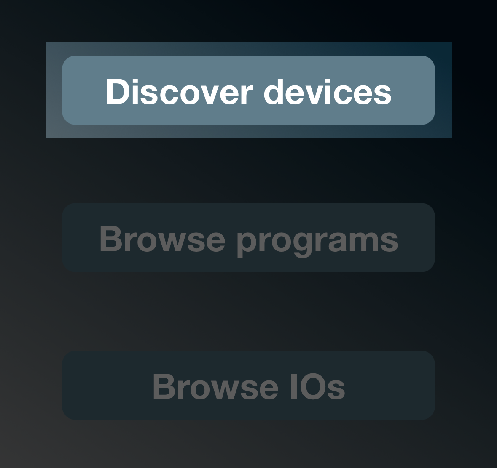

Press the "Device discovery" button on the main page to access the device list. All ESP32 devices connected to the same WiFi network as the iOS app will appear on this page. 
For connection to ESP32 devices running in AP mode (default), the iOS device needs to login to the AP network, which appears as esp32_XXX and has a default passphrase of "12345678".


In this case, the esp device's AP SSID (also the device's name) is esp32s3_indoor. Its IP address on the AP network is 192.168.1.1. The symbol  / 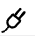 beside each device indicates the current connection status. Pressing the refresh button  at the bottom will trigger a refresh to the device list and connection states. Next, long press on the device's name to open the "device setting" page.
<br/>

___
**NOTE**<br/>
The basic version of this iOS app only supports displaying a maximum of one ESP32 device at a time. Upgrading to the pro version will remove this limitation.
___

<br/>

## Device Setting


The first line is the ESP32 device type and version number. You can replace the default AP SSID (also the device name) and passphrase with a more meaningful and secure value.
Set the WiFi availability to true and enter the SSID and passphrase of your WiFi network. Set the GMT offset of your local time in minutes. 

The default status LED GPIO number is 48, which is the built-in LED of ESP32s3-N8R8. The LED type is RGB WS2812B. 


Let’s briefly review the event logging. The first line displays the current time on the ESP32. “NTP” indicates that the time was obtained from an NTP server over the internet. If a DS3231 RTC module is attached, it will be shown as “DS3231”. The timestamp (DD HH:MM:SS) for each event is placed at the beginning of the event description. Events that occur before the ESP32 can retrieve time from the NTP server will be labeled as “old” or “new,” depending on whether they happened before the current boot. The symbols (E) and (I) denote error and information types of events, respectively.

___
**NOTE**<br/>
The events log does not refresh automatically. Press the reload button  to retrieve the latest logs.
___

Now, press the save button  at the bottom to save these changes to the remote ESP device. The remote device will reboot with the new settings and log in to your WiFi network.

___


This button switches the ESP32 device between operation and setting modes. In operation mode, the ESP32 device will run the uploaded program after a restart. If none is available or an error has occurred, it will revert to setting mode.

<br/>


This button will be visible when new firmware is available for the ESP32 device. Pressing the button will start firmware uploading to the ESP32 device. 
This process will take several minutes. During this process, please do not press any buttons. 
___
**NOTE**<br/>
If the progress bar is stagnant for more than 1 minute, the firmware update has encountered an error. Please restart the remote device and try again.
___

<br/>


Pressing this button will reset the remote ESP32 device. All settings and the existing program will be deleted.

<br/>


## Attach External Camera

The following example shows how to connect and set up non-FIFO memory camera sensors OV7670 and OV2640 on ESL32S3-DevkitC-1-N8R8.

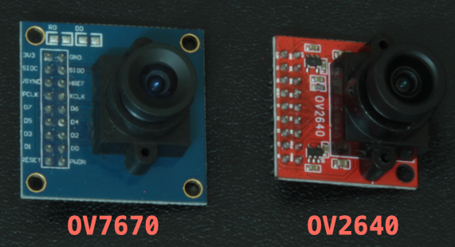 

___
**NOTE**<br/>
We have tested camera sensors OV7670 and OV2640. However, MataVision uses ESP32 camera driver from Espressif, [all sensor types](https://github.com/espressif/esp32-camera#supported-sensor) supported by this driver and supports QVGA(320x240) resolution and RGB565 pixel format, should also work.

___


<br/>
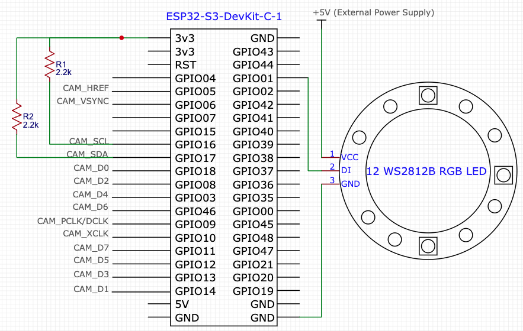 

The above schematic shows the connection between the ESP32S3 board, a camera module, and a ring of 12 addressable RGB LEDs. 

___

<br/>

## Camera Setting


For ESP32CAM or ESP32S3 devices, there is an option to add/enable a camera.

-  /   This icon indicates availability of camera (Gray = no / Black = yes).

-  For ESP32S3 devices, there is an option to add a camera. Press this button to enter the camera's setting page.

-  Press this button to enter the camera's view page.

-  Press this button to enter the camera's setting page.

-  Delete the camera. (Note: This doesn't work for ESP32-CAM as the camera is built onto the board.)

-  Turn ON or OFF the camera.

<br/>

### <a name="Add edit camera"></a>  or   

Pressing the plus icon (or the pencil icon if the camera is already set up) will open the camera settings page.

 

At a minimum, you need to set up all the pin numbers and the XCLK frequency. (For the built-in camera of the ESP32-CAM, all pins from D0 to SCL are read-only.)

 

Optionally, you can set up the camera flash. Press the save button  to trigger a reboot of the ESP32 device with the camera.


 

With the camera running, entering the camera settings page will display live video feed. Making changes to parameters with a white background will take effect after pressing the save button, without triggering an ESP32 reboot. Depending on the camera module type, some parameters may not have an effect. Experiment with them to see if they work for your camera module. Below are explanations for some of the abbreviations. Pressing the refresh button  will reset these settings to their default values.

- AWB: Auto White Balance.
- AEC: Automatic Exposure Control.
- DSP: Digital Signal Processor.
- AGC: Automatic Gain Control.
- BPC: Black Pixel Correction.
- WPC: White Pixel Correction.
- GMA: Gamma Correction.

<br/>
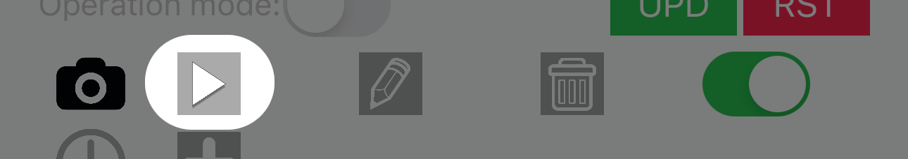 

The play button will be visible if the camera is successfully running, and pressing this button will open the camera’s view.


<br/>

## Camera View <a name="camera-viewing"></a> 


 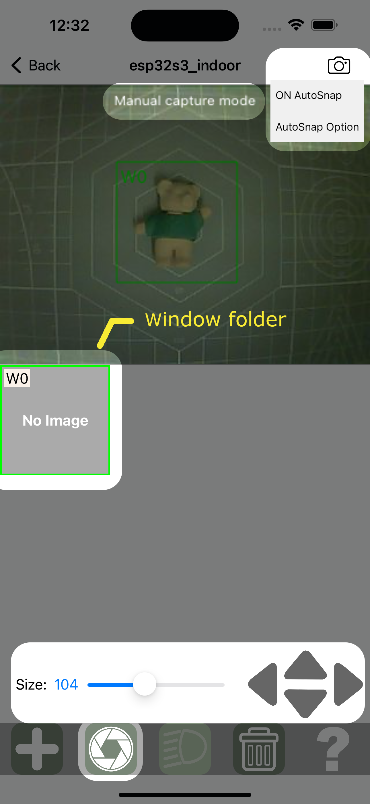 

Press the plus button to create a window folder for object classification or tracking. For a classification-type window, you can change the size or reposition it using the sliders and arrow buttons. For an object tracking-type window, the window will encompass the entire camera’s view. 

<br/>

## Image Capturing for Classification.
 

Each classification task is associated with a fixed window. Every pixel within this window will be analyzed during classification. The window should be large enough to fit all objects of interest during operation. However, if the window is too large compared to any object, the accuracy of classifying that object will be significantly affected. The ratio of object dimensions to window dimensions (B-dim/A-dim) should not be less than 0.6. Additionally, the number of images collected for each class should be sufficient to represent all possible configurations of that class.

By default, each window is in Manual Capture mode. In this mode, with a window selected, pressing the shutter button  will capture an image. All captured images will be placed in the window’s folder, and a long press on the window’s folder will open it. At this stage, all images from different classes are mixed together in a single window’s folder. You will later need to manually separate them into groups of classes during the classification preparation stage.

MataVision can handle a maximum of 20 classification tasks concurrently, and there is no limit to the number of classes for each classification task.

<br/>

## Image Capturing for Object Tracking.
MataVision’s object tracking has the following restrictions:

- It is designed for tracking a single object.
- The object’s width/height should fall between 0.5 and 2.0.
- The larger dimension (width or height) of the object should be no less than 32 pixels.
- The background should be relatively static, and no portion of the background should resemble the tracking object.
- The tracking position may not be exactly at the center of the object’s body.

For object tracking, the window encompasses the entire video view. The number of images collected should represent all possible orientations and positions of the object. Please note that at least one image must be without the object (only background).

During the object-tracking preparation stage, you will draw boundaries for the object in each image. Optionally, you can also mask out regions within the video view where object tracking is not required.

<br/>

## AutoSnap 

In AutoSnap mode, pressing the shutter button  will continuously capture images at a user-preset interval. The system then analyzes those images and keeps a user-defined number (N) of the most diverse images. You can enable AutoSnap by pressing the camera symbol  or accessing the “AutoSnap” menu at the top-right. The image capture interval and the maximum number of images to keep can be set in the option page, accessible from the “AutoSnap” menu.


### Autosnap Option
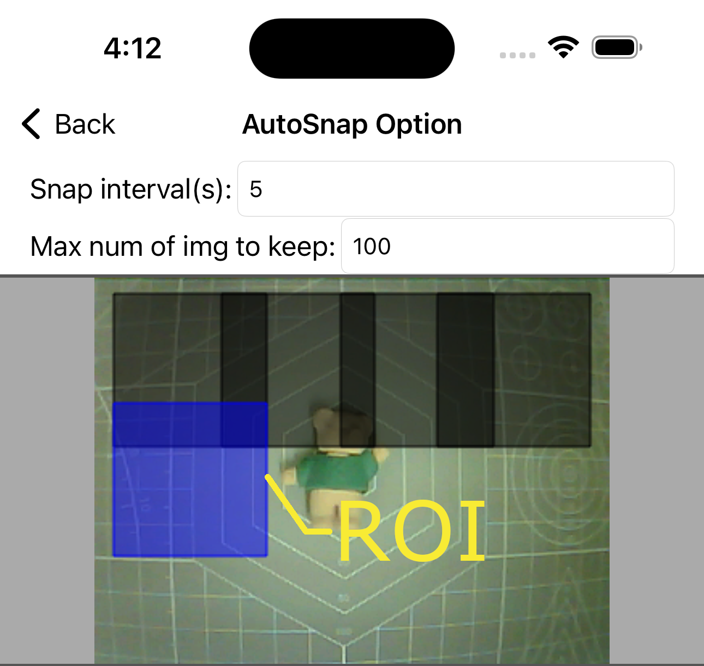 

For an object classification window, the entire region within the window will be analyzed when deciding which image to keep. For object tracking, you’ll need to add regions of interest (ROIs) within the window. This can be done in the Option page by pressing the plus button . These regions should be placed where the object will appear and should be slightly larger than the object but not excessively so. The ratio of Object-dim to Region-dim should not be less than 0.6.
<br/>


## Attach DS3231 RTC

If your application requires access to date and time, you need to set up a connection to WiFi so that the ESP32 can connect to an NTP server. Alternatively, a more robust solution is to attach a DS3231 RTC (Real Time Clock) module.


 

On the device settings page, press the plus button.

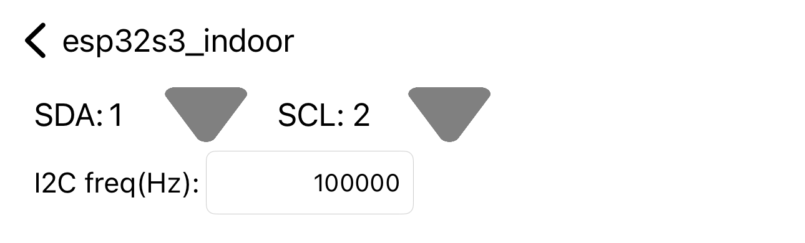 

Enter the SDA and SCL pin numbers and the I2C frequency for your DS3231 module. Press the save button, and the ESP32 will reboot with the DS3231 time.

 

Initially, the date and time of the DS3231 will not be correct. To fix this, press the sync button , and the DS3231’s time will synchronize with your iOS device.

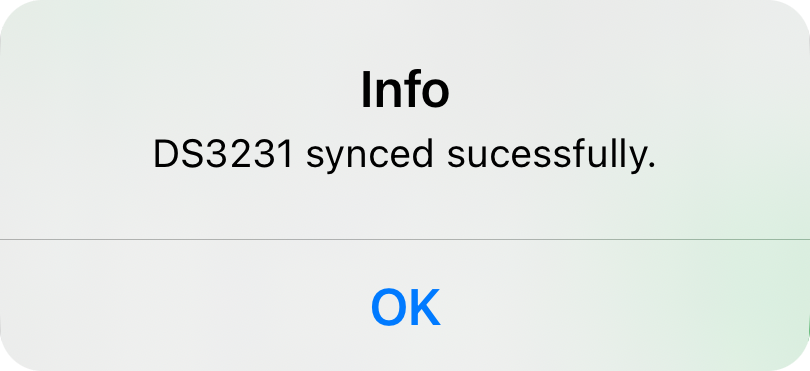 

<br/>

## App Demo Kit


The following sections will be refering to the above App Demo Kit.

## Create I/Os

 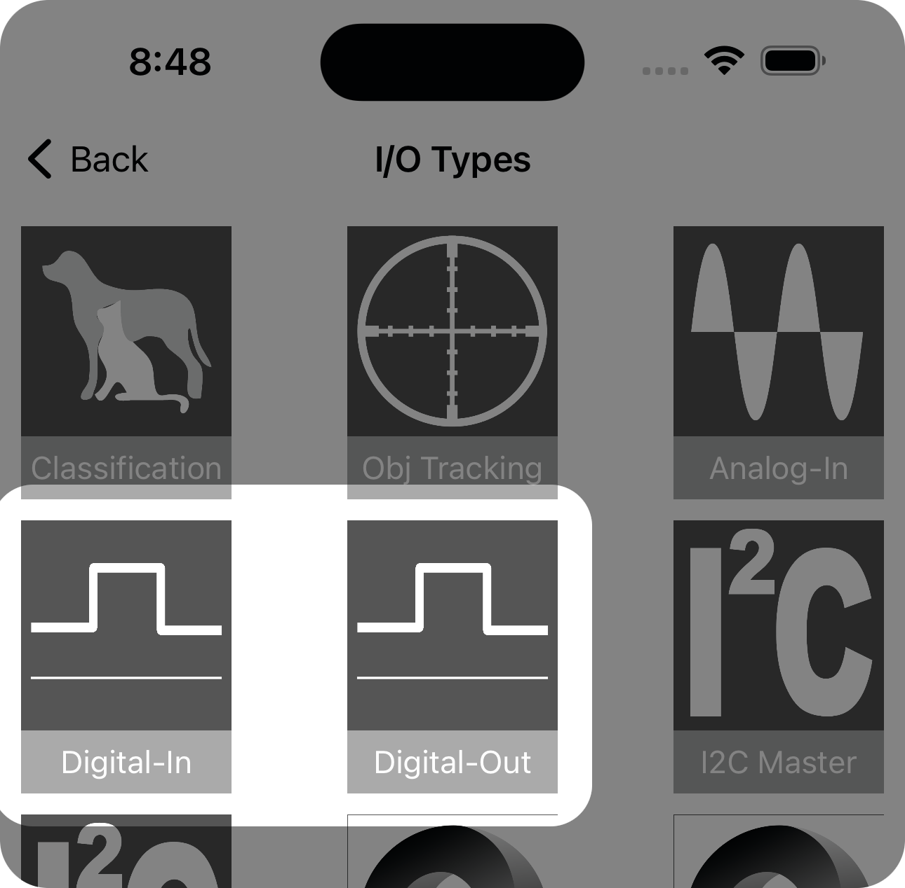

At the main page, press the Browse I/Os button to open the I/O types page. MataVision supports 13 types of I/O but for our purpose, we choose 2 simplest types; digital-in and digital-out.


Press the Digital-In button on the I/O types page will lead to the Digital-In page (top left image). The Digital-In page is empty because we have not created any digital-in object yet. 
Long press on the empty area to open the Digital-In editor page (middle image). Set the name as digIn13, the board type as ESP32-CAM, and the GPIO to 13. Press the save button at the bottom left to create this IO object. Repeat the same for Digital-Out (right image).


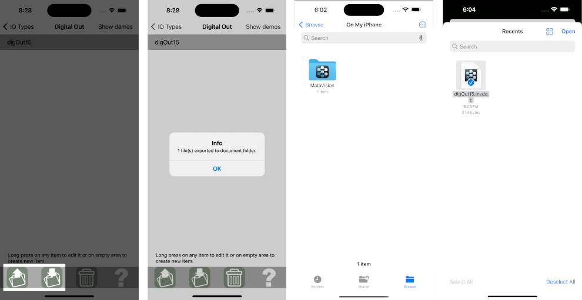

Those two buttons at the bottom left (top 1st image) are for file export to and import from the iOS device's document folder. Selecting any I/O objects and pressing the export button  will export them to the document folder (2nd image).
Pressing the import button  will open the document folder. All generated files are stored in the MataVision folder (3rd and 4th images). 

<br/>

## Create Program
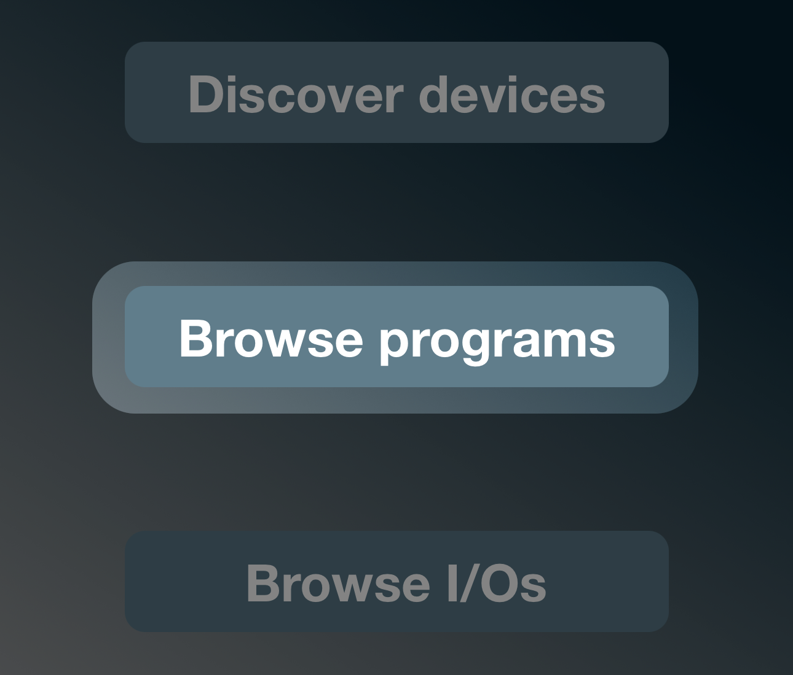 

At the main page, press the Browse programs button to open the Programs page.


Long press on the empty area (top left image) to open the program editor page. Change the program's name to Simple_IO. <br/> It is good practice to import all required I/Os before writing any code. Long press on the empty area of I/O values table (top middle image) or press the IO button  to open the I/O types page. Select Digital-In to open the Digital-In page. From there, select digIn13 and press the selection button  at the bottom. 
Repeat the same steps to import digOut15 from the Digital-Out page.  


To start writing code, select those imported I/Os in the I/O-values table (top left image) and touch the codes' area to bring up the keyboard.
Selecting those required I/Os before calling the keyboard will drop those I/O value names to the keyboard shortcut area (middle image).
In the codes area, write one line of code; digIn13 => digOut15, as shown in the top right image.
The code analysis window below the codes area will output an error message if an error is detected. In this case, there is no error. Press the save button and we have created our first program.


___
**NOTE**<br/>
Please check out the section on [programming](#programming) for a complete description of the features and syntax.
___

## Upload Program


At the Programs page, select the Simple_IO program and the target device from the device drop-down list.
Press the upload button  to start uploading the program to the target device. If the upload is successful, we receive a prompt, and the target device will reboot into operation mode. If the target device is working properly, its status LED will be solid blue. Press the push button and the red LED should light up. 
___
**NOTE**<br/>
1. If the target device is not in the device drop-down list, try to detect it on the Discovery devices page before returning here.
2. Check the target device's events log if anything goes wrong for more information.
___

## I/O Monitoring


If the ESP device is in operation mode, we can monitor the values of each I/O in the running program. Pressing the I/O Monitor button on the device setting page will open up the I/O monitoring page.


# Programming

MataVision uses simple logic instructions(SLI). 
An SLI instruction will consist of some (logical/arithmetic) operators and some inputs on the left, a conditional assignment in the middle, and one or more outputs on the right.

```
Input  =(Condition)>  Output
```
<br/>
A program consists of lines of SLI. It executes from top to bottom and will continue to loop over and over these instructions. 

<br/>

The rules and concepts of SLI are summarised as follows.

1. All inputs and outputs of the ESP device are represented by values (referred to as IO values). Each value has a name and all names have to be unique (case-sensitive) in a program. For example, the value of analog input from GPIO1 can be named "analogIn1". A more complicated image classification IO may have more than 1 value, such as "objIsApple", "objIsOrange" and "noObject" to represent 3 possible classes (apple, orange and no object).

1. There are 2 types of value and all values are global values (accessable anywhere in the program).
   
   * Numeric: Values such as -2.3, 0, 5, 12.345.
   * String: A string of characters. Strings can be created by enclosing characters inside double-quotes for example, "Hello World".

1. Boolean values are represented by numbers; 0 for false and 1 for true. Any number greater than 0 will be interpreted as true and any number less than or equal to 0 will be interpreted as false.

1. For each line of code, any characters after a comment symbol "//" will be ignored during operation.

1. Each line of code has one and only one assigning symbol "=>".

1. During operation, the value on the left-hand side(LHS) of "=>" will be assigned to the value(s) on the right-hand side(RHS).  <br/>
   Example:
   
   ```
   BtnPressed => LED1 // Turn ON LED1 when btn is pressed.
   ```

1. There can only be one resulting LHS value, but there can be multiple RHS values. Those RHS values have to be separated by a comma or a spacing. <br/>
   Examples:
   
   ```
   BtnPressed => LED1, LED2 // Turn ON LED1 and LED2 when btn is pressed.
   ```
   
   ```
   (1 + 3) => val1, val2 // Assign resulting value of (1+3) = 4 to val1 and val2.
   ```

1. LHS and RHS values have to be the same type.

1. Other than input or output values, we can create a variable. It can be a numeric, a string, or a numeric/string variable which defines what type of value it can store.<br/>
   Examples:
   
   ```
   2 => variable1 // Assign value 2 to a variable1.
   variable1 => displayLine1  // Display value 2.
   ```

1. The assign operator can accept a condition where it will only perform the assignment if the condition is true. This is done by placing the condition between the "=" and ">" symbols, and inside a bracket, "=(condition)>".<br/>
    Examples:
    
    ```
    2 =(true)> val1 // value of 2 will be assigned to val1.
    ```
    
    ```
    2 =(false)> val1 // No value will be assigned to val1.
    ```
    
    The condition can be an expression.
    
    ```
    2 =(2>1)> val1 // value of 2 will be assigned to val1.
    ```
    
    ```
    2 =(2<1)> val1 // No value will be assigned to val1.
    ```
    
    ```
    2 =(1+1)> val1 // value of 2 will be assigned to val1.
    ```
    
    ```
    2 =(1-1)> val1 // No value will be assigned to val1.
    ```
    
    The condition can be an IO value. The following example will display the string "Btn pressed" when digitalIn1 is true or else, will display "".
    
    ```
    "Btn pressed" =(digitalIn1)> displayLine1
    "" =(~digitalIn1)> displayLine1
    ```
    
    The condition can be a variable.
    
    ```
    (temperatureVal > 30) => variable1
    "Too Hot!" =(variable1)> displayLine1
    "Cool" =(~variable1)> displayLine1
    ```

1. In FIO, it is acceptable to use a variable before it is assigned. Any unassigned variables will be ignored during execution. As all values are global, these unassigned variables can be assigned later in a subsequent line and will be executed in the next execution loop.
    
    ```
    variable1 => LED1
    digitalIn1 => variable1
    ```
    
    However, be careful not to reassign different values to the same RHS value which will result in unexpected behaviors.<br/>
    Examples:
    
    ```
    True => LED1
    False => LED1
    ```
    
    <br/>

## Mathematic Operations

<br/>

| Symbol                                            | Description                        | Example(s)                                                 |
|:-------------------------------------------------:|:----------------------------------:| ---------------------------------------------------------- |
| +                                                 | Add                                | 1 + 2 = 3                                                  |
| -                                                 | Minus                              | 3 - 2 = 1                                                  |
| *                                                 | Multiply                           | 2 * 3 = 6                                                  |
| /                                                 | Divide                             | 3 / 2 = 1.5                                                |
| %                                                 | Modulo                             | 5 % 2 = 1                                                  |
| ^                                                 | Power                              | 2 ^ 3 = 8                                                  |
| sin, Sin, SIN                                     | Sine (unit radian)                 | sin(3.142) = 0.0 <br/>sin 0 = 0.0                          |
| cos, Cos, COS                                     | Cosine                             | cos(3.142) = -1.0                                          |
| tan, Tan, TAN                                     | Tangent                            | tan(3.142/4) = 1.0                                         |
| asin, Asin, ASIN                                  | Inverse sine                       | asin(1) = 1.571 <br/>asin -1 = -1.571                      |
| acos, Acos, ACOS                                  | Inverse cosine                     | acos 1 = 0 <br/>acos(-1) = 3.142                           |
| atan, Atan. ATAN                                  | Inverse tangent                    | atan(1) = 1.557                                            |
| sinh, Sinh, SINH                                  | Hyperbolic sine                    | sinh(1) = 1.175 <br/>sinh -1 = -1.175                      |
| cosh, Cosh, COSH                                  | Hyperbolic cosine                  | cosh 1 = 1.543 <br/>cosh(-1) = 1.543                       |
| tanh, Tanh, TANH                                  | Hyperbolic tangent                 | tanh(1) = 0.762 <br/>tanh(-1) = -0.762                     |
| asinh, Asinh, ASINH                               | Inverse sinh                       | asinh(1.175) = 1 <br/>asinh -1.175 = -1                    |
| acosh, Acosh, ACOSH                               | Inverse cosh                       | acosh 1.543 = 1                                            |
| atanh, Atanh, ATANH                               | Inverse tanh                       | atanh(0.762) = 1 <br/>atanh(-0.762) = -1                   |
| ln, Ln, LN                                        | Natural logarithm                  | ln(2.718) = 1 <br/>ln(1) = 0                               |
| log, Log, LOG                                     | Logarithm with base 10             | log(100) = 2 <br/>log(1) = 0                               |
| map(a,b,c,d)<br/>Map(a,b,c,d)<br/>MAP(a,b,c,d)    | Map linearly from range a<->b to c<->d | Map(a,b,c,d)5 will map to ((5 - a) / (b - a))*(d - c) + c. |
| clip(min,max)<br/>Clip(min,max)<br/>CLIP(min,max) | clip value to within range min~max | Clip(0,10)(-1) = 0<br/>Clip(0,10)15 = 10                   |
| <br/>                                             |                                    |                                                            |

## Comparison and Logical Operations

<br/>

| Symbol              | Description       |
|:-------------------:|:-----------------:|
| >                   | Greater than      |
| <                   | Less than         |
| >=                  | Greater or equal  |
| <=                  | Less or equal     |
| ==                  | Equal             |
| !=                  | Not equal         |
| and<br/>And<br/>AND | Logical AND       |
| or<br/>Or<br/>OR    | Logical OR        |
| xor<br/>Xor<br/>XOR | Logical Exclusive |

<br/>