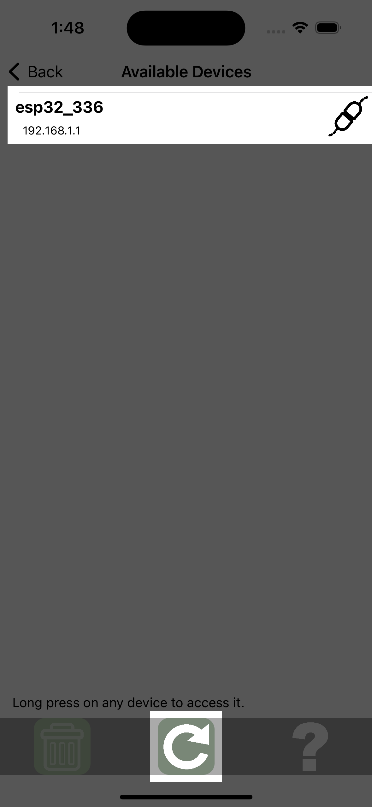
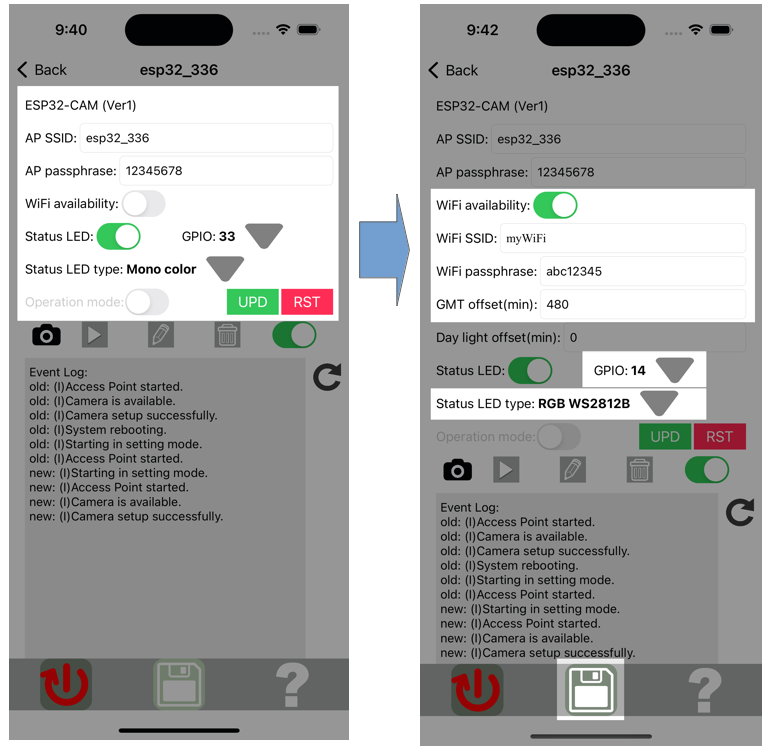
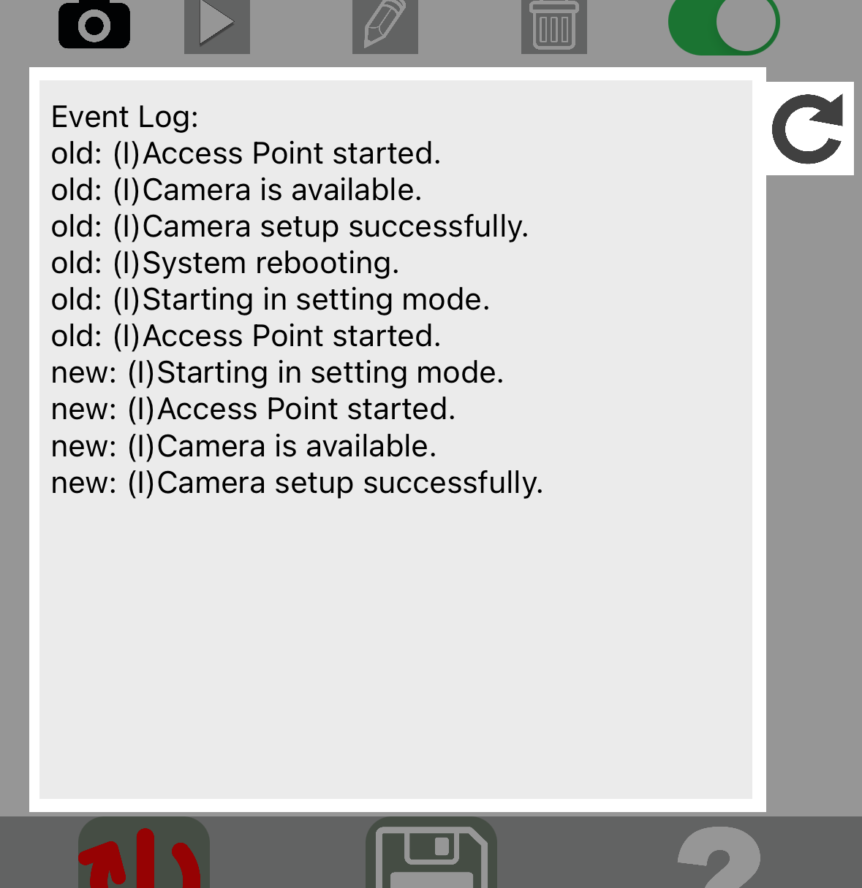

# MataVision (Your Affordable Edge-Based Vision Sensor)

## Overview
Supercharge your projects with MataVision, a powerful vision system that combines easy-to-use hardware and a user-friendly mobile app. At its core, MataVision consists of two parts:

- MataVision [Firmware](#firmware-installation): This lightweight firmware is flashed onto your ESP32-CAM or ESP32-S3 board, transforming it into a powerful vision sensor.
- MataVision [iOS App](#ios-app): This intuitive app acts as your command center, allowing you to train your vision system, define object detection parameters, and control outputs seamlessly.
Together, MataVision's hardware and software empower you to bring computer vision to your projects at a fraction of the cost of complex camera systems.

Here's what MataVision can do for you:

- Multiple Windows Image Classification: Train MataVision to recognize specific objects or scenes, ideal for applications like product sorting, state-change and anomaly detection.
- Single Object Tracking: Track the movement of object in real-time, perfect for motion detection, or autonomous systems.

The possibilities are endless! Here are some inspiring applications for MataVision across various industries:

- Smart Homes & Retail:
Detect an empty cat's bowl, parcels at the doorstep or door that is not fully closed.
Auto alert salesperson of customer presence or empty shelf.

- Industrial Automation:
Automate quality control by training MataVision to detect mixings, wrong orientations or missing components in products.
Perform remote sensing in hazardous or cramped environments where direct-contact sensing is not possible.
Enhance safety with real-time monitoring of machinery activity.

With MataVision, anyone can unlock the potential of computer vision in their projects.

#### (Supported boards)

- ESP32-CAM (4MB flash, 520KB RAM, 4MB PSRAM).
- ESL32S3-DevkitC-1-N8R8 (8MB flash, 512KB RAM, 8MB PSRAM).

## Firmware Installation

Firmware package can be downloaded from [folder](https://github.com/tensorfactory/MataVision/tree/main/firmwares). It consists of 4 files (bootloader.bin, partition-table.bin, boot_app0.bin, and firmware.bin). Please choose the right setting according to the ESP chip type for the flashing process.

 

| Filename               | Offset address (ESP32) | Offset address (ESP32S3) |
| ---------------------- |:----------------------:|:------------------------:|
| bootloader.bin         | 0x1000                 | 0x0000                   |
| partition-table.bin    | 0x8000                 | 0x8000                   |
| boot_app0.bin          | 0xe000                 | 0xe000                   |
| firmware.bin           | 0x10000                | 0x10000                  |

 

|           | ESP32  | ESP32S3 |
| --------- |:------:|:-------:|
| SPI speed | 40MHz  | 80MHz   |
| SPI mode  | DIO    | DIO     |
| Baud rate | 460800 | 460800  |

 

### (For Windows users)

We can use the "Flash Download Tools" from [Espressif](https://www.espressif.com/en/support/download/other-tools) to flash firmware bin files to an ESP device. Please follow the below steps for firmware flashing.

1. Connect an ESP device to a computer via USB. The connected port number can be found using Windows' "Device Manager". In this example, the ESP device was connected to COM3. (Note: For some ESP devices, we need to hold the BOOT button when powering ON to start in BOOT mode for firmware flashing.)
   
   

2. Start the "Flash Download Tools". Select the correct ESP chip type and click OK.
   
   

3. It is a good practice to erase the memory before flashing by clicking on the ERASE button. After erasing, input the paths of all the bin files and their respective offset positions.
   
   
   
   Select the correct SPI speed and mode (Please ensure the "DoNotChgBin" option is NOT checked.). After selecting the correct COM port and BAUD rate, click the START button to start flashing.

### (For Mac or Linux users)

For Mac and Linux OS, we need to use a Python module called "Esptool" to flash bin files to an ESP device. We can run the "pip install esptool" command to install this module. After we have installed esptool, follow the below steps for firmware uploading. 

1. Connect an ESP device to a computer via USB (For Mac users, we can identify the connect com port by running "ls /dev/cu.*" ). (Note: For some ESP devices, we need to hold the BOOT button when powering ON to start in BOOT mode for firmware flashing.)

2. It is a good practice to erase the memory before flashing. This can be done by running the following Python script.
   
   `% esptool.py erase_flash`

3. After erasing, run the following Python scripts to flash the respective firmware files. The following scripts assume the connected com port is "/dev/cu.usbserial-21110" and all firmware bin files are placed in path "firmwares/ESP32_.../", please modify according to your setting.
   
   (for ESP32_CAM)

   `% esptool.py -p "/dev/cu.usbserial-21110" -b 460800 --before default_reset --after hard_reset --chip esp32 write_flash -z --flash_mode dio --flash_size 4MB --flash_freq 40m 0x1000 firmwares/ESP32_CAM/bootloader.bin 0x8000 firmwares/ESP32_CAM/partition-table.bin 0xe000 firmwares/ESP32_CAM/boot_app0.bin 0x10000 firmwares/ESP32_CAM/firmware.bin`
   
    
   
   (for ESP32S3_N8R8)
   
   `% esptool.py -p "/dev/cu.usbserial-21110" -b 460800 --before default_reset --after hard_reset --chip esp32s3 write_flash -z --flash_mode dio --flash_size 8MB --flash_freq 80m 0x0000 firmwares/ESP32S3_N8R8/bootloader.bin 0x8000 firmwares/ESP32S3_N8R8/partition-table.bin 0xe000 firmwares/ESP32S3_N8R8/boot_app0.bin 0x10000 firmwares/ESP32S3_N8R8/firmware.bin`

After successfully flashing firmware to the ESP device, hard reboot it. If everything goes accordingly, the status LED (GPIO 33 in ESP-CAM, and GPIO48/38 in ESP32S3-DevkitC-1-N8R8) will blink, indicating the MataVision is loading before turning to solid ON. If an error has occurred,  the status LED will stay OFF for ESP32 or turn to red for ESP32S3 devices. 

  

## iOS App

The MataVision iOS app is available for download on the Apple App Store. This app serves as your central hub for everything related to MataVision, from managing ESP32 devices to development, debugging, and deployment of your vision applications.

A typical workflow starts with connecting to an ESP32 device running the MataVision firmware. You'll then set up the camera and begin capturing images for your vision tasks.

Next comes defining the vision inputs. These inputs, which provide data for your program, can be for tasks like image classification or object tracking. Each input can have one or more values. For example, a cat-or-dog classification might have two boolean values ("is_a_dog" and "is_a_cat") and one integer value ("class_index"). You can also add non-vision inputs like GPIOs, I2C, and Cloud services if needed.

After defining the inputs, you'll set up the corresponding outputs. Once you have all the inputs and outputs prepared, you can start writing a program that links them together and upload it to your ESP32 device.

This section will provide a step-by-step guide on how to perform all these tasks.
- ESP Devices Management.   
   - [Devices Discovery](#devices-discovery).
   - [Device Setting](#device-setting).
   - [Camera Setting](#camera-setting).
   - [Camera Viewing](#camera-viewing).
   - [Image Capturing](#image-capturing).
- Applications Development.
   - [Create IOs](#create-ios).
   - [Create Program](#create-program).
   - [Upload Program](#upload-program).

 

### Devices Discovery

Press the "Device discovery" button on the main page to access the device list. All ESP devices connected to the same WiFi network as the iOS app will appear on this page. 
For connection to ESP devices running in AP mode (default), the iOS device needs to login to the AP network, which appears as esp32_XXX and has a default passphrase of "12345678".

In this case, the esp device's AP SSID (also the device's name) is esp32_336. Its IP address on the AP network is 192.168.1.1. The symbol  /  beside each device indicates the current connection status. Pressing the refresh button  at the bottom will trigger a refresh to the device list and connection states. Next, long press on the device's name to open the "device setting" page.
 

___
**NOTE** 
The basic version of this iOS app only supports displaying a maximum of one ESP device at a time. Upgrading to the pro version will remove this limitation.
___

 

## Device Setting

### (Device setting window)

The first line is the ESP device type and version number. You can replace the default AP SSID (also the device name) and passphrase with a more meaningful and secure value.
For this example, set the WiFi availability to true and enter the SSID and passphrase of your WiFi network. Set the GMT offset of your local time in minutes. 

The default status LED GPIO number is 33, which is the built-in LED of ESP32-CAM. This LED is at the bottom surface of the board, which is not very visible. Change the GPIO number to 14 and the LED type to RGB WS2812B, as shown in App-Demo-Kit's circuit diagram. Before saving the changes, let's briefly review the events logging.

At this moment, the ESP device does not have access to the NTP time server to retrieve the current time. Once an internet connection is available, a timestamp (DD HH:MM:SS) will be placed at the beginning of each event log.  
The (E) and (I) indicate error or information type of event.

___
**NOTE** 
The events log does not refresh automatically. Press the reload button  to retrieve the latest logs.
___

Now, press the save button  at the bottom to save these changes to the remote ESP device. The remote device will reboot with the new settings and log in to your WiFi network.

___
**NOTE** 
Sometimes the remote device does not behave accordingly after the setting change. The attached camera failed to start, or the status LED blinked unpredictably. In these situations, fully power-down the device for more than 10 seconds should fix the problem.
___

This button switches the ESP device between operation and setting modes. In operation mode, the ESP device will run the uploaded program after a restart. If none is available or an error has occurred, it will revert to setting mode.

 

This button will be visible when new firmware is available for the ESP device. Pressing the button will start firmware uploading to the ESP device. 
This process will only work in AP mode. Switch the ESP device to AP mode and connect the iOS device directly to the AP network before starting.
This process will take several minutes. During this process, please do not press any buttons. 
___
**NOTE** 
If the progress bar is stagnant for more than 10 seconds, the firmware update has encountered an error. Please restart the remote device and try again.
___

 

Pressing this button will reset the remote ESP device. All settings and the existing program will be deleted.

 

### (Camera setting window)

For ESP32CAM or ESP32S3 devices, there is an option to add/enable a camera.

-  /   This icon indicates availability of camera (Gray = no / Black = yes).

-  For ESP32S3 devices, there is an option to add a camera. Press this button to enter the camera's setting page.

-  Press this button to enter the camera's view page.

-  Press this button to enter the camera's setting page.

-  Delete the camera. (Note: This doesn't work for ESP32-CAM as the camera is built onto the board.)

-  Turn ON or OFF the camera.

 

## Camera Setting   

 

For the built-in camera of ESP32-CAM, all pins from D0 to SCL are read-only. You may want to change the V-flip or H-mirror settings to suit your setup. The rest of the parameters are already optimized for this built-in camera. 

___
**NOTE** 
After making any changes, remember to go to the device setting page and press the save button to upload those changes.
___

 

## Camera Viewing  

 

In this example (left image), the camera view was upside-down. Press the gear icon at the top right to open the camera's setting page and turn ON the V-flipped setting to rectify this. The right image shows the camera's flashlight toggled ON/OFF by pressing the flashlight button.

 

## Image Capturing
 

Before we capture any image, we need to define a window in the camera's view. Press the plus button at the bottom left to create a window. Adjust the window size by moving the slider and dragging the window to the desired position, as shown in the 2nd image. 
While selecting the window, press the shuttle button to capture an image. All images captured will be placed in the window folder. The number at the top right of the window folder is the image count. 
Pressing the plus button again will create another window. Each window will be named W0, W1, ..., up to W9. While selecting any window and pressing the shuttle button, an image will be captured for that window. Finally, to view or delete those images of a window, long press on the window's folder to open the folder.
___
**NOTE** 
It is not allowed to change the size or position of a window that contains images.
___
 

## Simple logic instructions(SLI)

## Components for MataVision
MataVision consists of two components. A firmware that enables ESP32 board to function as a vision sensor and an iOS app for managing images collections, 