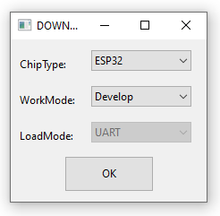
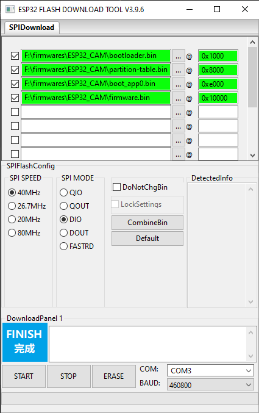
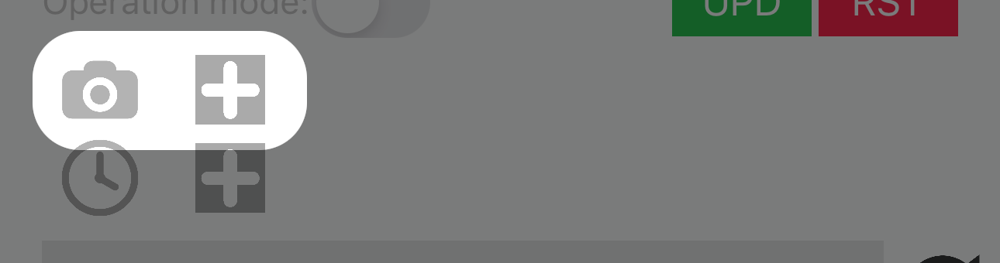
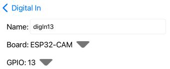
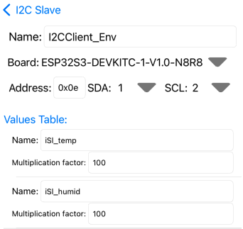
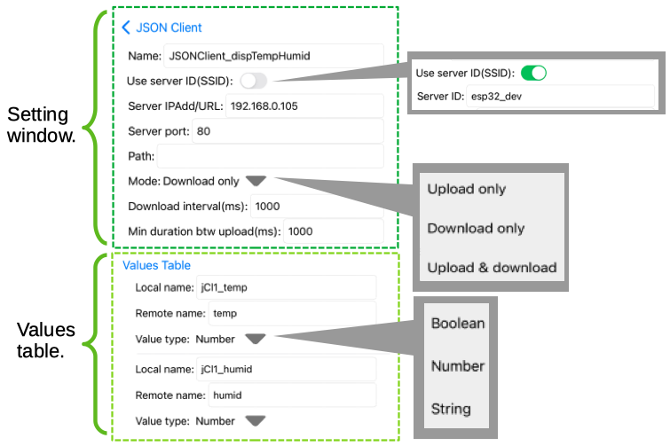

# MataVision (An Affordable Edge-Based Vision System)


## Contents

- [Overview](#overview).
- [A Typical Workflow](#a-typical-workflow).
- [Supported Boards](#supported-boards).
- [Firmware Installation](#firmware-installation).
- [iOS App](#ios-app).
   - ESP32 Devices Management.   
      - [Devices Discovery](#devices-discovery).
      - [Device Setting](#device-setting).
      - [Attach External Camera](#attach-external-camera).
      - [Camera Setting](#camera-setting).
      - [Camera Viewing](#camera-view).
      - [Image Capturing For Classification](#image-capturing-for-classification).
      - [Image Capturing for Object Tracking](#image-capturing-for-object-tracking).
      - [AutoSnap](#autosnap).
      - [Attach DS3231 RTC](#attach-ds3231-rtc).

   - Applications Development.
      - [Create I/O Objects](#create-i-o-objects).
      - [Create Program](#create-program).
      - [Upload Program](#upload-program).
      - [I/O Monitoring](#i-o-monitoring).
- [Programming](#programming).
   - [The Rules and Concepts of SLI](#the-rules-and-concepts-of-sli).
   - [Mathematic Operations](#mathematic-operations).
   - [Comparison and Logical Operations](#comparison-and-logical-operations).
- [IOs ](#ios).
   - [Classification](#classification).
   - [Object Tracking](#object-tracking).
   - [GPIOs](#gpios).
   - [I2C Master](#i2c-master).
   - [I2C Slave](#i2c-slave).
   - [JSON Server](#json-server).
   - [JSON Client](#json-client).
   - [Clock](#clock).
   - [Counter/Timer](#counter-timer).
   - [Filter](#filter).
   - [I2C Display](#i2c-display).
   - [Motor](#motor).
   - [Firebase Realtime Database](#firebase-realtime-database).
- [Privacy Policy](#privacy-policy).
- [Terms and conditions](#terms-and-conditions).

<br/>


# Overview
MataVision transforms your ESP32 modules into easy-to-use vision systems, providing object classification and tracking at the edge. At its core, MataVision consists of two main components:

1. MataVision [Firmware](#firmware-installation): This lightweight firmware is flashed onto your ESP32-CAM or ESP32-S3 board, transforming it into a powerful vision system.
2. MataVision [iOS App](#ios-app): This intuitive app serves as your command center, allowing you to control and program ESP32 devices.

### Image Collection and Preparation
As with any vision task, collecting good representative images and carefully preparing them is crucial for successful vision training. MataVision includes elaborate, easy-to-use tools for these tasks.


### Interaction with I/O Systems
In many practical vision tasks, it is often necessary to incorporate inputs from or output data to external systems. MataVision includes a list of I/O types (shown below the image) to enable interaction with some of the common I/O devices.


### Integrating Vision with I/O Systems
Finally, we need a method to instruct MataVision on how to integrate all the data from vision and I/O systems into something useful for our application. For this, we devised a minimal programming method.

No, you don’t have to learn a new programming language. It is just basic high school arithmetic and logic. All you need to know are:

1. A MataVision program consists of lines of Simple Logic Instructions (SLI). It executes from top to bottom and will continue to loop over these instructions.

2. An SLI instruction consists of three segments: an input value on the left, a condition in the middle, and one or more output values on the right. <br/><br/> When the condition is evaluated to be TRUE, the value on the left will be assigned to the right.

For illustration, the following six example programs will do the same thing: turn ON the LED when the switch is pressed.<br/>
<br/>


   ```
   // Example 1
   mySwitch =(True)> myLED
   ```
   ```
   // Example 2
   mySwitch =(1+1>1)> myLED
   ```
   ```
   // Example 3
   mySwitch =(1)> myLED
   ```
   Example 3 works because any value larger than 0 will be evaluated as true.<br/>
   ```
   // Example 4
   mySwitch => myLED
   ```
   In Example 4, we just use the assignment symbol when we want it to always assign.
   ```
   // Example 5
   mySwitch => myVariable
   myVariable => myLED
   ```
   In Example 5, we introduce a temporary variable to store the value from mySwitch.
   ```
   // Example 6
   True =(mySwitch)> myLED
   False =(~mySwitch)> myLED
   ```
   In the above example, if we only have the first line, it will assign a true value to myLED when mySwitch is true. However, no value will be assigned to myLED when mySwitch is false. This will cause the LED to stay ON once it is switched ON. We need the second line to assign a false value to the LED when the switch is not pressed.


___
**NOTE**<br/>
Programming in MataVision is meant to allow basic controls and interactions with I/O devices. It is not suitable for creating complex applications.
___


<br/><br/>

# A Typical Workflow

1. Attaching a camera module, such as OV7670 or OV2640, to the ESP32.
2. Optionally attaching a DS3231 RTC (Real Time Clock) module to the ESP32.
3. Flashing the MataVision Firmware onto the ESP32.
4. Connecting the MataVision iOS App to the ESP32.
5. Collecting sample images for object classification or tracking training.
6. Creating classification objects by grouping images for each class.
7. Creating object tracking objects by drawing bounding boxes on sample images.
8. Creating supporting I/O objects.
9. Writing a small [program](#create-program) incorporating all values from vision and I/O objects into a single logic unit and uploading it to the ESP32.

<br/><br/>

# Supported Boards
MataVision requires a minimum of 4MB flash, 500KB RAM, and 4MB PSRAM on an ESP32 device. Currently, we have created firmware for two boards: ESP32-CAM and ESL32S3-DevkitC-1-N8R8. If you need to run MataVision on another ESP32 module, please contact us.


- ESP32-CAM: 4MB flash, 520KB RAM, 4MB PSRAM.
- ESL32S3-DevkitC-1-N8R8: 8MB flash, 512KB RAM, 8MB PSRAM.

<br/><br/>

# Firmware Installation

Firmware package can be downloaded from [folder](https://github.com/tensorfactory/MataVision/tree/main/firmwares). It consists of 4 files (bootloader.bin, partition-table.bin, boot_app0.bin, and firmware.bin). Please choose the right setting according to the ESP32 chip type for the flashing process.


<br/>

| Filename               | Offset address (ESP32) | Offset address (ESP32S3) |
| ---------------------- |:----------------------:|:------------------------:|
| bootloader.bin         | 0x1000                 | 0x0000                   |
| partition-table.bin    | 0x8000                 | 0x8000                   |
| boot_app0.bin          | 0xe000                 | 0xe000                   |
| firmware.bin           | 0x10000                | 0x10000                  |

<br/>

|           | ESP32  | ESP32S3 |
| --------- |:------:|:-------:|
| SPI speed | 40MHz  | 80MHz   |
| SPI mode  | DIO    | DIO     |
| Baud rate | 460800 | 460800  |

<br/>

### (For Windows users)

You can use the "Flash Download Tools" from [Espressif](https://www.espressif.com/en/support/download/other-tools) to flash firmware bin files to an ESP32 device. Please follow the below steps for firmware flashing.

1. Connect an ESP32 device to a computer via USB. The connected port number can be found using Windows' "Device Manager". In this example, the ESP32 device was connected to COM3. (Note: For some ESP32 devices, we need to hold the BOOT button when powering ON to start in BOOT mode for firmware flashing.)
   
   

2. Start the "Flash Download Tools". Select the correct ESP32 chip type and click OK.
   
   

3. It is a good practice to erase the memory before flashing by clicking on the ERASE button. After erasing, input the paths of all the bin files and their respective offset positions.
   
   
   
   Select the correct SPI speed and mode (Please ensure the "DoNotChgBin" option is NOT checked.). After selecting the correct COM port and BAUD rate, click the START button to start flashing.

### (For Mac or Linux users)

For Mac and Linux OS, we need to use a Python module called "Esptool" to flash bin files to an ESP device. We can run the "pip install esptool" command to install this module. After we have installed esptool, follow the below steps for firmware uploading. 

1. Connect an ESP device to a computer via USB (For Mac users, you can identify the connect com port by running "ls /dev/cu.*" ). (Note: For some ESP devices, you need to hold the BOOT button when powering ON to start in BOOT mode for firmware flashing.)

2. It is a good practice to erase the memory before flashing. This can be done by running the following Python script.
   
   `% esptool.py erase_flash`

3. After erasing, run the following Python scripts to flash the respective firmware files. The following scripts assume the connected com port is "/dev/cu.usbserial-21110" and all firmware bin files are placed in path "firmwares/ESP32_.../", please modify according to your setting.
   
   (for ESP32_CAM)

   `% esptool.py -p "/dev/cu.usbserial-21110" -b 460800 --before default_reset --after hard_reset --chip esp32 write_flash -z --flash_mode dio --flash_size 4MB --flash_freq 40m 0x1000 firmwares/ESP32_CAM/bootloader.bin 0x8000 firmwares/ESP32_CAM/partition-table.bin 0xe000 firmwares/ESP32_CAM/boot_app0.bin 0x10000 firmwares/ESP32_CAM/firmware.bin`
   
   <br/>
   
   (for ESP32S3_N8R8)
   
   `% esptool.py -p "/dev/cu.usbserial-21110" -b 460800 --before default_reset --after hard_reset --chip esp32s3 write_flash -z --flash_mode dio --flash_size 8MB --flash_freq 80m 0x0000 firmwares/ESP32S3_N8R8/bootloader.bin 0x8000 firmwares/ESP32S3_N8R8/partition-table.bin 0xe000 firmwares/ESP32S3_N8R8/boot_app0.bin 0x10000 firmwares/ESP32S3_N8R8/firmware.bin`

After successfully flashing firmware to the ESP32 device, hard reboot it. If everything goes accordingly, the status LED (GPIO 33 in ESP-CAM, and GPIO48/38 in ESP32S3-DevkitC-1-N8R8) will blink, indicating the MataVision is loading before turning to solid ON. If an error has occurred,  the status LED will stay OFF for ESP32 or turn to red for ESP32S3 devices. 

<br/><br/>

# iOS App


The MataVision iOS app is available for download on the Apple App Store. This app serves as your central hub for everything related to MataVision, from managing ESP32 devices to development, debugging, and deployment of your vision applications.

This section will provide a step-by-step guide on how to perform all these tasks.
- ESP32 Devices Management.   
   - [Devices Discovery](#devices-discovery).
   - [Device Setting](#device-setting).
   - [Attach External Camera](#attach-external-camera).
   - [Camera Setting](#camera-setting).
   - [Camera Viewing](#camera-view).
   - [Image Capturing For Classification](#image-capturing-for-classification).
   - [Image Capturing for Object Tracking](#image-capturing-for-object-tracking).
   - [AutoSnap](#autosnap).
   - [Attach DS3231 RTC](#attach-ds3231-rtc).

- Applications Development.
   - [Create I/O Objects](#create-i-o-objects).
   - [Create Program](#create-program).
   - [Upload Program](#upload-program).
   - [I/O Monitoring](#i-o-monitoring).


<br/>

## Devices Discovery


After flashing the firmware, the ESP32 device will boot into Access Point mode for the first time. Connect your iOS device to this AP network. The AP network’s name will be in the form esp32_XXX with the default passphrase “12345678”. On the main page of the iOS App, press the “Device discovery” button to access the device list. The ESP32 device should appear on this page.


In this case, the ESP device’s AP SSID (also the device’s name) is esp32s3_indoor. Its IP address on the AP network is 192.168.1.1. The symbol  /  beside each device indicates the current connection status. Pressing the refresh button  at the bottom will update the device list and connection statuses. Next, long press on the device’s name to open the “Device setting” page.
<br/>


## Device Setting


The first line displays the ESP32 device type and version number. You can replace the default AP SSID (also the device name) and passphrase with more meaningful and secure values.

Setting the WiFi availability to true and entering the SSID and passphrase of your WiFi network will allow the ESP32 device to connect to it. This has two advantages. Firstly, your iOS app will now connect to the ESP32 device over your local network, and if this network has Internet access, both devices will also have Internet access. Secondly, any ESP32 devices connected to this network will also appear on the Device list page, allowing for multiple device management.

___
**NOTE**<br/>
The standard-version iOS app does not allow listing multiple ESP32 devices. Upgrade to the pro-version to remove this restriction.
___

If your local network has Internet access, the ESP32 device will try to locate the NTP server to retrieve the current time. You can set the correct GMT and daylight offset to reflect the local time accurately.

You can also change the status LED settings here.

Now, press the save button  at the bottom to save these changes to the remote ESP device. The remote device will reboot with the new settings and connect to your WiFi network.

<br/>

## Event Log


Let’s briefly review the event logging. The first line displays the current time on the ESP32. “NTP” indicates that the time was obtained from an NTP server over the Internet. If a DS3231 RTC module is attached, it will be shown as “DS3231”. The timestamp (DD HH:MM:SS) for each event is placed at the beginning of the event description. Events that occur before the ESP32 can retrieve time from the NTP server will be labeled as “old” or “new,” depending on whether they happened before the current boot. The symbols (E) and (I) denote error and information types of events, respectively.

___
**NOTE**<br/>
The events log does not refresh automatically. Press the reload button  to retrieve the latest logs.
___

<br/>


This button switches the ESP32 device between operation and setting modes. In operation mode, the ESP32 device will run the uploaded program after a restart. If none is available or an error has occurred, it will revert back to setting mode.

<br/>


This button will be visible when new firmware is available for the ESP32 device. Pressing the button will start firmware uploading to the ESP32 device. 
This process will take several minutes. During this process, please do not press any buttons. 
___
**NOTE**<br/>
If the progress bar is stagnant for more than 1 minute, the firmware update has encountered an error. Please restart the remote device and try again.
___

<br/>


Pressing this button will reset the remote ESP32 device. All settings and the existing program will be deleted.

<br/>


## Attach External Camera

The following example shows how to connect and set up non-FIFO memory camera sensors OV7670 and OV2640 on ESL32S3-DevkitC-1-N8R8.

 

___
**NOTE**<br/>
We have tested camera sensors OV7670 and OV2640. However, MataVision uses ESP32 camera driver from Espressif, [all sensor types](https://github.com/espressif/esp32-camera#supported-sensor) supported by this driver and supports QVGA(320x240) resolution and RGB565 pixel format, should also work.

___


<br/>
 

The above schematic shows the connection between the ESP32S3 board, a camera module, and a ring of 12 addressable RGB LEDs. 

___

<br/>

## Camera Setting 


<br/>

  /   This icon indicates availability of camera (Gray = no / Black = yes).

For ESP32CAM or ESP32S3 devices, there is an option to add/enable a camera.

### <a name="Add edit camera"></a>  or   


Pressing the plus icon (or the pencil icon if the camera is already set up) will open the camera settings page.

 

At a minimum, you need to set up all the pin numbers and the XCLK frequency. (For the built-in camera of the ESP32-CAM, all pins from D0 to SCL are read-only.)

 

Optionally, you can set up the camera flash. Press the save button  to trigger a reboot of the ESP32 device with the camera.


 

With the camera running, entering the camera settings page will display live video feed. Making changes to parameters with a white background will take effect after pressing the save button, without triggering an ESP32 reboot. Depending on the camera module type, some parameters may not have an effect. Experiment with them to see if they work for your camera module. Below are explanations for some of the abbreviations. Pressing the refresh button  will reset these settings to their default values.

- AWB: Auto White Balance.
- AEC: Automatic Exposure Control.
- DSP: Digital Signal Processor.
- AGC: Automatic Gain Control.
- BPC: Black Pixel Correction.
- WPC: White Pixel Correction.
- GMA: Gamma Correction.

<br/>
 

A list of new buttons will be visible if the camera is successfully running.


-  Press this button to enter the camera's view page.

-  Press this button to enter the camera's setting page.

-  Delete the camera. (Note: This doesn't work for ESP32-CAM as the camera is built onto the board.)

-  Turn ON or OFF the camera.

Pressing the play button  will open the camera’s view.


<br/>

## Camera View <a name="camera-viewing"></a> 


  

Press the plus button to create a window folder for object classification or tracking. For a classification-type window, you can change the size or reposition it using the sliders and arrow buttons. For an object tracking-type window, the window will encompass the entire camera’s view. 

<br/>

## Image Capturing for Classification
 

Each classification task is associated with a fixed window. Every pixel within this window will be analyzed during classification. The window should be large enough to fit all objects of interest during operation. However, if the window is too large compared to any object, the accuracy of classifying that object will be significantly affected. The ratio of object dimensions to window dimensions (B-dim/A-dim) should not be less than 0.6. Additionally, the number of images collected for each class should be sufficient to represent all possible configurations of that class.

By default, each window is in Manual Capture mode. In this mode, with a window selected, pressing the shutter button  will capture an image. All captured images will be placed in the window’s folder, and a long press on the window’s folder will open it. At this stage, all images from different classes are mixed together in a single window’s folder. You will later need to manually separate them into groups of classes during the classification preparation stage.

MataVision can handle a maximum of 20 classification tasks concurrently, and there is no limit to the number of classes for each classification task.

<br/>

## Image Capturing for Object Tracking
MataVision’s object tracking has the following restrictions:

- It is designed for tracking a single object.
- The object’s width/height should fall between 0.5 and 2.0.
- The larger dimension (width or height) of the object should be no less than 32 pixels.
- The background should be relatively static, and no portion of the background should resemble the tracking object.
- The tracking position may not be exactly at the center of the object’s body.

For object tracking, the window encompasses the entire video view. The number of images collected should represent all possible orientations and positions of the object. Please note that at least one image must be without the object (only background).

During the object-tracking preparation stage, you will draw boundaries for the object in each image. Optionally, you can also mask out regions within the video view where object tracking is not required.
<br/>

## AutoSnap 
Capturing the perfect images for vision training can be challenging when we don’t have full control over the object’s movement, such as with a live animal. We may wait for hours only to miss the shot when we’re not looking. It would be ideal if MataVision could monitor and automatically take the best photo for us. However, doing so requires processing power and memory that the ESP32 does not have. Instead, we can ask MataVision to do the next best thing: continuously capture images and automatically decide which ones to keep.

To do this, we need to tell MataVision three things on the AutoSnap Option Page:

1. Which sections of the image (Regions of Interest) to analyze when choosing the best images.
2. How many images to keep.
3. The time interval between image captures.
<br/>

### Autosnap Option
You can access the AutoSnap Option by pressing the camera symbol  or the “AutoSnap” menu at the top-right. 

 

For an object classification window, the entire region within the window will be analyzed when deciding which image to keep. For object tracking, you’ll need to add regions of interest (ROIs) within the window. This can be done on the Option page by pressing the plus button . These regions should be placed where the object will appear and should be slightly larger than the object but not excessively so. The ratio of Object-dim to Region-dim should not be less than 0.6.
<br/>

### Autosnap Mode
In AutoSnap mode, pressing the shutter button  will continuously capture images at a user-preset interval. The system then analyzes those images and keeps a user-defined number (N) of the most diverse images. You can turn ON AutoSnap by pressing the camera symbol  or accessing the “AutoSnap” menu at the top-right.

<br/>


## Attach DS3231 RTC

If your application requires access to date and time, you need to set up a connection to WiFi so that the ESP32 can connect to an NTP server. Alternatively, a more robust solution is to attach a DS3231 RTC (Real Time Clock) module.


 

On the device settings page, press the plus button.

 

Enter the SDA and SCL pin numbers and the I2C frequency for your DS3231 module. Press the save button, and the ESP32 will reboot with the DS3231 time.

 

Initially, the date and time of the DS3231 will not be correct. To fix this, press the sync button , and the DS3231’s time will synchronize with your iOS device.

 

<br/>

## App Demo Kit


The following sections will be refering to the above App Demo Kit.

## Create I/O Objects <a name="create-i-o-objects"></a>

 

On the main page, press the “Browse I/Os” button to open the I/O types page. MataVision supports 15 types of I/O, but for our purposes, we will choose the two simplest types: digital-in and digital-out.

We will create a digital-in type object to receive data from GPIO pin 13 (the push button switch) and a digital-out type to output data to GPIO pin 15 (the red LED).


<br/>
Pressing the digital-in button on the I/O types page will lead to the digital-in page (top left image). The digital-in page is empty because we have not created any digital-in objects yet. Long press on the empty area to open the digital-in editor page (middle image). Set the name as digIn13, the board type as ESP32-CAM, and the GPIO to 13. Press the save button at the bottom left to create this I/O object. Repeat the same for the digital-out object (right image).

<br/>


<br/>
The two buttons at the bottom left (top 1st image) are for file export to and import from the iOS device’s document folder. Selecting any I/O objects and pressing the export button  will export them to the document folder (2nd image). Pressing the import button  will open the document folder. All generated files are stored in the MataVision folder (3rd and 4th images).

<br/>
What we have done is create two I/O objects. Each object has one value. A digital-in type object called digIn13 has an value also called digIn13. A digital-out type object called digOut15 has an value also called digOut15.

<br/>
Please note that some I/O objects can have more than one value. For example, an object-classification object will have multiple values, one for each class. A cat or dog classification object will have a minimum of two values.

<br/>

## Create Program
 

On the main page, press the “Browse programs” button to open the Programs page.


Long press on the empty area (top left image) to open the program editor page. Change the program’s name to Simple_IO. <br/> 
It is good practice to import all required I/Os before writing any code. Long press on the empty area of the I/O values table (top middle image) or press the “IO” button  to open the I/O types page. Select “Digital-In” to open the Digital-In page. From there, select digIn13 and press the selection button  at the bottom. This will import digIn13 into your program. Repeat the same steps to import digOut15 from the Digital-Out page.


To start writing code, select the imported I/Os in the I/O values table (top left image) and touch the code area to bring up the keyboard. Selecting the required I/Os before calling the keyboard will drop those I/O value names into the keyboard shortcut area (middle image). In the code area, write one line of code: digIn13 => digOut15, as shown in the top right image. The code analysis window below the code area will output an error message if an error is detected. In this case, there is no error. Press the save button, and we have created our first program.

### Program Editing Extras


If you see a tiny blue dot in front of a value in the I/O values table, this indicates that the original object associated with this value has been modified after it was imported into this program. If you are sure you want the modification to be incorporated into your program, select the value in the value table and press the refresh button  at the bottom left to update your I/O values.

In the above code, we have intentionally put extra spacing in the middle of the assignment symbol “=>”, which is a syntax error. This is highlighted in red, and the error description is shown in the code analysis area near the bottom.


___
**NOTE**<br/>
Please check out the section on [programming](#programming) for complete documentation of MataVision Programming.
___

## Upload Program


On the Programs page, select the Simple_IO program and the target device from the device drop-down list. Press the upload button  to start uploading the program to the target ESP32 device. If the upload is successful, you will receive a prompt, and the target device will reboot into operation mode. If the target device is working properly, its status LED will turn solid blue. Now, press the push button on the target device, and the red LED should light up.
___
**NOTE**<br/>
1. If the target device is not shown in the device drop-down list, try to detect it on the Discovery devices page before returning here.
2. Check the target device’s event log for more information if anything goes wrong.
___

<br/>

## I/O Monitoring <a name="i-o-monitoring"></a>


When an ESP32 device is in operation mode, you can monitor the values of each I/O from the iOS app. Pressing the “I/O Monitor” button on the device setting page will open the I/O monitoring page.

<br/>

# Programming


In MataVision programming, we use I/O objects to interact with external systems and Simple Logic Instructions (SLI) to integrate them into an application. We will use a hypothetical case to demonstrate how this is done. <br/>

In this case, we need to build an application to check every incoming bottle for a missing cap. If a cap is missing, a siren should be triggered for 5 seconds.<br/>

First, we create a classification object (object-1) named “Cap_Detection” to detect missing caps. It has two boolean values named “capped” and “missing_cap”. When it detects a capped bottle, the value “capped” will return TRUE and the value “missing_cap” will return FALSE. The reverse results will be returned when it detects a non-capped bottle. <br/>
Next, we create a digital-out object (object-2) named “Siren”. It has a boolean value named “ON_siren” which, when set to TRUE, will turn ON the siren.<br/>
We then write our program to turn ON the siren when a missing cap is detected, as shown below:
<br/>

```
missing_cap => ON_siren
```
The above code will turn ON the siren as long as a missing cap is detected, but we only want the siren to be ON for 5 seconds. To achieve this, we create a counter/timer object (object-3) called “ON_5s” which has one value called “ON_5s_trig” and another value called “ON_5s_out”. When we set “ON_5s_trig” to TRUE, it will set “ON_5s_out” to TRUE for 5 seconds before setting it back to FALSE.<br/>
We then modify our code as shown below:

```
missing_cap => ON_5s_trig
ON_5s_out => ON_siren
```
Instead of directly assigning the “missing_cap” value to “ON_siren”, we first assign it to “ON_5s_trig” and then assign “ON_5s_out” to “ON_siren”. This will ensure the siren is only ON for 5 seconds.<br/>

Next, we need to fix one final issue. Currently, the vision is continuously checking, but in practice, we only want the vision to check when the bottle is in position, not when it is moving in or out. To do this, we will place a positioning sensor to check if a bottle is in position. We interface this sensor with a digital-in object (object-4) named “Bottle_Position” and name its value “in_position”. This object will only set the “in_position” value to TRUE when a bottle is in position.
<br/>
Finally, we update the first line of our code by inserting this “in_position” value as a condition for the assignment:
```
missing_cap =(in_position)> ON_5s_trig
ON_5s_out => ON_siren
```


<br/>

## The Rules and Concepts of SLI

The example program above has shown how we can use Simple Logic Instructions (SLI) to create a simple application. In this section, we will formally list all the rules and concepts of SLI.

1. All I/Os of the ESP32 device are represented as I/O objects, and each can have one or more values (referred to as I/O values). Each value has a name, and all names must be unique (case-sensitive) within a program. For example, a simple analog-in object for GPIO1 will have one value named “analogIn1”. A more complex image classification object may have more values, such as “isApple”, “isOrange”, and “noObject” to represent three possible classes (apple, orange, and no object).

1. A value’s name must be alphanumeric or an underscore and not begin with a number.<br/> Examples:
   * myValue
   * _myValue
   * _2ndValue
   * value_2

1. There are three types of values, and all values are global (accessible anywhere in the program).
   * Boolean: TRUE or FALSE
   * Numeric: Values such as -2.3, 0, 5, 12.345.
   * String: A string of characters. Strings can be created by enclosing characters inside double quotes, for example, “Hello World”.

1. Boolean and numeric values are treated interchangeably in MataVision. Booleans can be represented by numbers: 0 for FALSE and 1 for TRUE. Any number greater than 0 will be interpreted as TRUE, and any number less than or equal to 0 will be interpreted as FALSE.

1. For each line of code, any characters after a comment symbol "//" will be ignored during operation.

1. Each line of code has one and only one assigning symbol "=>".

1. During operation, the value on the left-hand side (LHS) of “=>” will be assigned to the value(s) on the right-hand side (RHS). <br/>
   Example:
   
   ```
   BtnPressed => LED1 // Turn ON LED1 when btn is pressed.
   ```

1. There can only be one resulting LHS value, but there can be multiple RHS values. Those RHS values must be separated by a comma or a space. <br/>
   Examples:
   
   ```
   BtnPressed => LED1, LED2 // Turn ON LED1 and LED2 when btn is pressed.
   ```
   
   ```
   (1 + 3) => val1, val2 // Assign resulting value of (1+3) = 4 to val1 and val2.
   ```

1. LHS and RHS values must be of the same type, except for boolean and numeric values, which are interchangeable.

1. In addition to I/O values, we can create variables. Any valid name that does not coincide with any of the imported I/O value names will be treated as a variable.<br/>
   Examples:
   
   ```
   2 => myVariable // Assign value 2 to a myVariable.
   myVariable => displayLine1  // Display value 2.
   ```

1. The assignment operator can accept a condition where it will only perform the assignment if the condition is TRUE. This is done by placing the condition between the “=” and “>” symbols, and inside a bracket, “=(condition)>”.<br/>
    Examples:
    
    ```
    2 =(TRUE)> val1 // value of 2 will be assigned to val1.
    ```
    
    ```
    2 =(FALSE)> val1 // No value will be assigned to val1.
    ```
    
    The condition can be an expression.
    
    ```
    2 =(2>1)> val1 // value of 2 will be assigned to val1.
    ```
    
    ```
    2 =(2<1)> val1 // No value will be assigned to val1.
    ```
    
    ```
    2 =(1+1)> val1 // value of 2 will be assigned to val1.
    ```
    
    ```
    2 =(1-1)> val1 // No value will be assigned to val1.
    ```
    
    The condition can be an I/O value. The following example will display the string “Btn pressed” when digitalIn1 is TRUE; otherwise, it will display “”.
    
    ```
    "Btn pressed" =(digitalIn1)> displayLine1
    "" =(~digitalIn1)> displayLine1
    ```
    
    The condition can be a variable.
    
    ```
    (temperatureVal > 30) => variable1
    "Too Hot!" =(variable1)> displayLine1
    "Cool" =(~variable1)> displayLine1
    ```

1. In MataVision, it is acceptable to use a variable before it is assigned. Any unassigned variables will be ignored during execution. Since all values are global, these unassigned variables can be assigned later in a subsequent line and will be executed in the next execution loop.
    
    ```
    variable1 => LED1
    digitalIn1 => variable1
    ```
    <br/>

## Mathematic Operations

<br/>

| Symbol                                            | Description                        | Example(s)                                                 |
|:-------------------------------------------------:|:----------------------------------:| ---------------------------------------------------------- |
| +                                                 | Add                                | 1 + 2 = 3                                                  |
| -                                                 | Minus                              | 3 - 2 = 1                                                  |
| *                                                 | Multiply                           | 2 * 3 = 6                                                  |
| /                                                 | Divide                             | 3 / 2 = 1.5                                                |
| %                                                 | Modulo                             | 5 % 2 = 1                                                  |
| ^                                                 | Power                              | 2 ^ 3 = 8                                                  |
| sin, Sin, SIN                                     | Sine (unit radian)                 | sin(3.142) = 0.0 <br/>sin 0 = 0.0                          |
| cos, Cos, COS                                     | Cosine                             | cos(3.142) = -1.0                                          |
| tan, Tan, TAN                                     | Tangent                            | tan(3.142/4) = 1.0                                         |
| asin, Asin, ASIN                                  | Inverse sine                       | asin(1) = 1.571 <br/>asin -1 = -1.571                      |
| acos, Acos, ACOS                                  | Inverse cosine                     | acos 1 = 0 <br/>acos(-1) = 3.142                           |
| atan, Atan. ATAN                                  | Inverse tangent                    | atan(1) = 1.557                                            |
| sinh, Sinh, SINH                                  | Hyperbolic sine                    | sinh(1) = 1.175 <br/>sinh -1 = -1.175                      |
| cosh, Cosh, COSH                                  | Hyperbolic cosine                  | cosh 1 = 1.543 <br/>cosh(-1) = 1.543                       |
| tanh, Tanh, TANH                                  | Hyperbolic tangent                 | tanh(1) = 0.762 <br/>tanh(-1) = -0.762                     |
| asinh, Asinh, ASINH                               | Inverse sinh                       | asinh(1.175) = 1 <br/>asinh -1.175 = -1                    |
| acosh, Acosh, ACOSH                               | Inverse cosh                       | acosh 1.543 = 1                                            |
| atanh, Atanh, ATANH                               | Inverse tanh                       | atanh(0.762) = 1 <br/>atanh(-0.762) = -1                   |
| ln, Ln, LN                                        | Natural logarithm                  | ln(2.718) = 1 <br/>ln(1) = 0                               |
| log, Log, LOG                                     | Logarithm with base 10             | log(100) = 2 <br/>log(1) = 0                               |
| map(a,b,c,d)<br/>Map(a,b,c,d)<br/>MAP(a,b,c,d)    | Map linearly from range a<->b to c<->d | Map(a,b,c,d)5 will map to ((5 - a) / (b - a))*(d - c) + c. |
| clip(min,max)<br/>Clip(min,max)<br/>CLIP(min,max) | clip value to within range min~max | Clip(0,10)(-1) = 0<br/>Clip(0,10)15 = 10                   |
| <br/>                                             |                                    |                                                            |

## Comparison and Logical Operations

<br/>

| Symbol              | Description       |
|:-------------------:|:-----------------:|
| >                   | Greater than      |
| <                   | Less than         |
| >=                  | Greater or equal  |
| <=                  | Less or equal     |
| ==                  | Equal             |
| !=                  | Not equal         |
| and<br/>And<br/>AND | Logical AND       |
| or<br/>Or<br/>OR    | Logical OR        |
| xor<br/>Xor<br/>XOR | Logical Exclusive |
| true<br/>True<br/>TRUE | Logical True |
| false<br/>False<br/>FALSE | Logical False |

<br/>


# I/Os 


MataVision provides tools for interfacing with 15 types of I/O.
Pressing the "Browse I/Os" button on the main page will bring us to the "I/O Types" page. From here, choose the type of I/O to create. Pressing on any icon will go to the page that lists all created I/O objects of the respective type.
Please see an [example of IO creation](#create-ios) in the iOS App section.


<br/>

## Classification <a name="classification"></a>


If you have captured classification images for any ESP32 devices, press the drop-down button  to select the device. Please refer to the section on 
[Image Capturing for Classification](#image-capturing-for-classification) if you have not done so.

Once you have selected a device, all available classification windows will be shown in the “Available windows” area. Select a window, and all images from that window will be loaded into the “Available images” area.

Next, create all necessary class folders by pressing the plus button . Here, we have created five class folders (“empty”, “pink_rabbit”, “blue_rabbit”, “green_bear”, and “red_bear”). For each class, drag the respective images from the “Available Images” area into the folder.

<br/>
If you need to make changes after dragging incorrect images into a folder, long press on the folder. This will open the folder, and you can delete the incorrect images. If you want to rename a folder, select the folder and press the rename button .

<br/>
Once you finish segregating images into each class folder, press the save button , and this classification object will be ready for use in your program.


### Classification Option


When you import a classification object into your program, all the class values will be available in the I/O values table, along with an extra auto-generated class-index value. In this example, the class-index value is auto-named “animalClass_idx”. This is an integer indicating the index of the current detected class. The index starts at 0 for the first class, 1 for the second class, 2 for the third class, and so on.
<br/>
As for the class values, they will return TRUE if it is the current detected class and FALSE otherwise.

<br/>
If you have set up a flash on the ESP32 device, you can select the flash option, and a value named “Flash” will be included in the I/O values table, which you can use in your program.

```
TRUE => Flash // Turn ON flash when program run.
```
<br/>

Depending on the ESP32 board type, you can choose the vision model’s size: S for small, M for medium, and L for large. The larger the model, the better the classification accuracy, but it will run slower.

| Board Type          | Models Supported  |
|:-------------------:|:-----------------:|
| ESP32-CAM           | S, M              |
| ESP32s3-N8R8        | S, M, L           |


### Classification-Live


During operation, you can observe the ongoing classification results on the [I/O monitoring](#io-monitoring) page.

<br/>

## Object Tracking <a name="object-tracking"></a>


If you have captured object tracking images for any ESP32 devices, press the drop-down button  to select the device. Please refer to the section on [Image Capturing for Object Tracking](#image-capturing-for-object-tracking) if you have not done so.

Once you have selected a device, all available object tracking windows will be shown in the “Available windows” area. Select a window and press the import button  to import all available images from this window.

You can gain more working space in full-screen mode by pressing the full-screen button  at the top right corner.

You can choose an initial sensitivity level (Sens lv) between 1 and 10, which you can later fine-tune during operation.

<br/>


Select any image from the imported images area to start editing. Referring to the top left image, press the bbox button  to add a bounding box (bbox). Drag the bbox to the center of the target object and adjust its size to match the object by using the sliders . You can also use the cursors   for finer position adjustments.

<br/>

In the middle image above, the pink squares represent masked areas. Masking out areas where the target object will never reach will significantly speed up vision training and object tracking. With any image selected, you can add masking squares by first pressing the masking button  to enter mask-editing mode and then selecting the masking area by touching the white grids.

<br/>

During object tracking, you will get three values: a boolean indicating if the target object is detected and two integers for the X and Y coordinates of the object. You can also set up regions within the camera’s view where the region-index value will tell you in which region the object is currently located. To add regions, first select any image and press the region button  to enter region-editing mode. Next, start drawing regions by touching and dragging on the image. You can refine the region size and position by using the size sliders and cursors.


### Object Tracking Option


When you import an object-tracking object into your program, the object detection, coordinates, and region index value names will be loaded into the I/O values table.
<br/>

Depending on the ESP32 board type, you can choose the vision model’s size: S for small or M for medium. The larger the model, the better the tracking accuracy, but it will run slower.

| Board Type          | Models Supported  |
|:-------------------:|:-----------------:|
| ESP32-CAM           | S                 |
| ESP32s3-N8R8        | S, M              |


### Object Tracking-Live


When an ESP32 is running object tracking, you can fine-tune the sensitivity level on the I/O Monitor page. Pressing the save button  will upload the new setting to the ESP32 device, which takes effect immediately. However, this new sensitivity level will only be saved on the ESP32 device. The original program on the iOS app will not be affected.
<br/>
Also, when you hide the masks or regions on the I/O Monitoring page, it will only affect the video streaming and have no effect on the operation.

___
**NOTE**<br/>
1. The origin of the object tracking coordinate system is located at the top left corner of the camera’s view.
1. The size of the camera's view is 320 x 240 pixels.
___

<br/>

## GPIOs<a name="gpios"></a>   
___
 

For GPIO such as digital input, analog input, and digital output, it is only required to select a value name and a GPIO PIN. The option to select board type is only for filtering the available pins for the target device.


<br/>

## I2C Master <a name="i2c-master"></a>

The purpose of the I2C Master is to retrieve data from external devices (such as sensors) using the I2C protocol. It does this in two stages: setup and data retrieval.

In the first stage, it sends some “setup” instructions to the external device and waits for a duration before moving to the data retrieval stage.

During the data retrieval stage, it will send “data-collection” instructions to the external device, wait for the data to be ready, and then start reading it from the external device. It then converts the returned bytes into integers and linearly maps them to the final float values. It then waits for a predefined duration before repeating these data retrieval steps over and over.

### Limits
This two-stage method used by the I2C Master has its limits. For one, there is no provision for the I2C Master to respond to the external device. Secondly, it may not be suitable for values that cannot be linearly mapped from bytes.

### AHT10  
 

The AHT10 is a temperature and humidity sensor with an I2C interface. It has simple setup instructions and returns bytes that can be easily interpreted. We will use it as an example to set up an I2C-Master object. 

  

There are a few crucial pieces of information that we need to gather for the sensor:

* The I2C address of the sensor.
* Instructions for setting up the sensor.
* Instructions for triggering measurements.
* The number of bytes to read after each instruction and how to interpret the returned bytes.
* Wait times required after each step.
* The sampling rate of the measurement.

From the sensor’s datasheet, we find the I2C address to be 0x38. The soft-reset instruction byte is 10111010 (binary) or 0xBA (hex), and the soft reset takes less than 20ms. The instruction to trigger measurement consists of three bytes: 0xAC, 0x33, and 0x00, and we need to wait at least 75ms before starting the reading process.

   

There are six bytes of data to read. The humidity data consists of 20 bits, located in bytes 2, 3, and 4, starting from bit 1 of byte 2 to bit 4 of byte 4. The temperature data also consists of 20 bits, located in bytes 4, 5, and 6, starting from bit 5 of byte 4 to bit 8 of byte 6.


 

From the datasheet, we get “humidAHT” = S<sub>RH</sub> * 0.000095 and “tempAHT” = (S<sub>T</sub> * 0.00019) - 50, where S<sub>RH</sub> and S<sub>T</sub> are integers derived from the returned bits.<br/> Additionally, from our internet research, we learned that if the sampling rate of the measurement is too high, the sensor will overheat. To prevent the temperature of the sensor from rising above 0.1°C, we will set the sampling rate to once every 2 seconds.


### AHTXX_DEMO
  

MataVision provides a list of “demo” examples for using I2C-Master, and we will use AHTXX_DEMO as the base for creating AHT10. If you do not see the list of “demos,” press the menu that says “show demo” at the top right corner.

  

First, rename the object’s name to AHT10 and set the SDA and SCL pins as per our requirements. The I2C address (0x38) is already filled in. In the “Wait b4 next loop cyc(ms)” field, which is the sampling rate, enter 2000 for 2 seconds. Next, write a script for setting up AHT10 and start reading temperature and humidity data
<br/>

I2C-Master scripting has five functional keywords: setup, loop, write, read, and wait.

* Setup (or setup): Indicates the start of the “setup” section. Code in this section will be executed only once, at the start of the program.
* Loop (or loop): Indicates the start of the “looping” section.
* Write (or write): For writing bytes to the I2C device.
* Read (or read): For reading bytes and interpreting them.
* Wait (or wait): Wait for a number of milliseconds.

Under the “Setup” section, we write a byte (0xBA) to AHT10, instructing it to carry out a soft reset. We also set a waiting time of 20ms before moving to the “Loop” section.

In the “Loop” section, we write three bytes (0xAC, 0x33, and 0x00) to instruct AHT10 to start the measurement process and wait for 80ms before starting to read data from AHT10.

 

The “6” following the “read” keyword denotes the number of bytes to read. The two brackets contain instructions on how to map the returned bytes to the values “humidHT” and “tempAHT”.

* Value’s name: Name of the value.
* Byte position: Indicates the byte position in the stream of bytes that were returned.
* Start bit position: Indicates the starting bit in the byte to include.
* End bit position: Indicates the ending bit in the byte to include.
* Is 2's complement: Indicates if those bits are to be interpreted as signed integer in [2's complement](https://en.wikipedia.org/wiki/Two%27s_complement) format.
* Gradient, offset: Used for linearly mapping the integer to a float value: valFloat = (valInt * gradient) + offset.
 
 
 ___
**NOTE**<br/>
1. It is possible to set a wait time of 2000ms at the end of the looping section instead of setting it in the “Wait b4 next loop cyc(ms)” field. However, because MataVision has to finish executing code from each I2C-Master object before moving to the next object, putting a “wait” in the code will delay the execution of the next object.

1. Remember to add a pull-up resistor, each to SDA and SCL lines. We used 2.2Kohm.
___

<br/>

## I2C Slave <a name="i2c-slave"></a> 

 


I2C-Slave is used to send values over to an I2C-Master. Each value is sent as 32-bits (4bytes) signed integers in [2's complement](https://en.wikipedia.org/wiki/Two%27s_complement) format. 

Float values with "n" significant digits can first be multiplied with 10<sup>n</sup> before sending as an integer. At the I2C master's end, the received integer can be divided by 10<sup>n</sup> to recover the original float value. This multiplication factor can be set during the creation of each value.

To create a value, press the plus button  . Each value has a multiplication factor. For example, a temperature value of 18.82 which has a multiplication factor of 100 will be converted to 1882(=18.82 x 100) before send out.

If there are multiple values, they will be sent in a continuous of bytes following the order in the values table. As in the above example, 8 bytes will be sent (4 bytes each for values "iSl_temp" and "iSl_humid").


 ___
**NOTE**<br/>
Remember to add a pull-up resistor, each to SDA and SCL lines. We used 2.2Kohm.
___


<br/>

## JSON Server <a name="json-server"></a> 

 

JSON-Server serves and receives data in JSON key-value pairs. There are three mode options (upload only, download only and upload & download). Choosing a mode will means those values will be write-only, read-only, read and write, respectively.

Pressing the plus button  to create a new value. Each value has 2 names. A "local" name is to be referred to locally during programming and a "remote" name will be used to communicate with remote clients (in JSON key/value pairs). They can both be the same. 

When JSON-Server receives an HTTP "GET" request with the matching path (in the setting window, above), it will return all values in JSON key/value pairs. When it receives an HTTP "PATCH" request follows by JSON key/value pairs from a remote client, it will update its local copy of the values with the received ones.

<br/>

## JSON Client <a name="json-client"></a> 

 

JSON-Client sends and receives data in JSON key-value pairs to/from JSON server. There are three mode options (upload only, download only and upload & download). Choosing a mode will means those values will be write-only, read-only, read and write, respectively.

Pressing the plus button  to create a new value. Each value has 2 names. A "local" name is to be referred to locally during programming and a "remote" name will be used to communicate with remote server (in JSON key/value pairs). They can both be the same. 

JSON-Client uses HTTP "GET" method to request data from server and  HTTP "PATCH" method to send data to server.

A remote server can be identified by its IPAddress or URL. If the server is an MataVision JSON-Server and is connected to the same local network, we can use the SSID of the server for identification.


<br/>

## Clock <a name="clock"></a> 

The Clock object provides access to date and time. However, to use it, MataVision must be able to connect to an NTP server during boot-up or have a DS3231 module installed.

There are three parameters to set up a clock object: the repeat mode (None, minutely, hourly, daily, weekly, monthly, or yearly), the start datetime, and the ON duration.

During operation, when the setup conditions are met, the clock’s state will return a TRUE value. The clock’s state can be accessed by the object’s name.


In the example above, we use a clock object to turn a light ON daily from 9am to 5pm. We set the repeat mode to daily, the start time to 9am, and the ON duration to 8 hours.

In the code, we assign the clock’s name to the light.

```
daily_9to5 => lightON
```


<br/>

## Counter/Timer <a name="counter-timer"></a> 

 

### ON Duration / Reset Mode
In some applications, you may want to use a Counter/Timer (CT) to control the timing and duration of an event. For example, if you need to turn on an alarm for 5 seconds when it is triggered, you can create a CT object with a 5000 ms ON duration that auto-resets after completion.

 

When a TRUE value is assigned to “CT_str” (Start name), it will set the “CT_out” (Output name) to TRUE for 5 seconds. After the ON period completes, it will reset itself and be ready for a new cycle.

 

If you prefer not to have the CT auto-reset, you can set it to “Manual” mode and manually reset it by assigning TRUE to “CT_rst” (Reset name).

### ON Delay

 


### Manual OFF
 

If this feature is turned ON, the CT’s output value will persist until a TRUE value is assigned to “CT_stp” (Stop name).

### Delay by Counts

 

In certain situations, you may want an event to occur only after several triggers. For example, you might want the alarm to turn ON only after the third trigger. To achieve this, you can set the “ON delay counts” to 3.

### Send Completion
 

This feature causes the CT to output a completion pulse to “CT_com” when the output ON duration completes. You can use this to trigger other events.

### Auxiliary Values
 

These are internal values of the Counter/Timer that you can access using their names:

* CT_cnt: The delay Counter's value.
* CT_elapT: The time elapsed in miliseconds since Start.
* CT_onT: The time elapsed in miliseconds since ON.
* CT_dlyT: The delay Timer's value in miliseconds.


<br/>

## Filter <a name="filter"></a> 

The Filter object smooths noisy input using an exponential moving average (EMA).
```
noisyValue => filter_in
filter_out => smoothedValue
```


 

### Value Type

The Filter object can be set to handle categorical inputs. In this mode, the input value is converted to integers, with each integer representing a category. The Filter object can handle up to 30 categories. Any additional new categories will be ignored.


### Smoothing Duration
 

The Filter object smooths the input value by averaging the current value with older values. A larger smoothing duration means greater weight is given to older values, making the filter less sensitive to sudden changes in value.

As a rough guide, if the input value rises from 0 to 1, the output value will rise from 0 to 0.9 over the smoothing duration.


<br/>

## I2C Display <a name="i2c-display"></a>

  

The “I2C-Display” currently supports LCD16x2, LCD20x4, and OLED (with SSD1306 and SH1106 drivers) with resolutions of 128x64, 128x32, 64x48, and 64x32. (Note: LCDs require an I2C module (converter) to communicate with the I2C-Display.)

 

The I2C-Display can be configured to display lines of text. Each line is composed of segments of constants and variables. In the example below, the I2C-Display line “Temp = {tempVal, 1}C” is composed of three segments. Segments 1 and 3 are constant text, and segment 2 is a variable that will be replaced with the actual value during operation. (Note: The maximum number of segments a line can have is 7.)

A variable can be a numeric or string value. If a string value is provided, the decimal point will be ignored. (Note: The maximum number of decimal points is 5.)

 

To add a line to the display, press the plus button . For each line, the starting coordinate needs to be specified. The coordinate origin is at the top left of the display. LCD and OLED have different coordinate units. For LCD, the coordinate is in the number of characters, whereas for OLED, the coordinate is in pixels. Please see below for illustrations. (Note: The maximum number of lines is 6.)

 

(Note: For OLED display types, you can choose from several font sizes, and there is an option to vertically flip the display.)

Code example:

```
28.2 => tempVal
50 => humidVal
```

<br/>

## Motor <a name="motor"></a>

  

The “Motor” feature supports 4-wire stepper motors and analog-servo motors. For 4-wire stepper motors, it supports three modes: Full-step 1 phase ON, Full-step 2 phases ON, and Half-step 1 phase ON. Please see the phase charts below for each mode. (Note: The vertical axis represents the wire number, and the horizontal axis represents the step number.)

  

In this example of a stepper motor, two instructions were created: “forward” and “backward.” (Press the plus button  to create a new instruction.)

Each instruction consists of a series of paths. When an instruction is called, the program will execute all its paths. (Select an instruction and press the pencil button  to enter the instruction editing page.) 
Refer to the settings below for each instruction. In the “forward” instruction, there are three paths. Path 1 moves 100 steps in the positive direction, starting at a speed of 20 steps/s and linearly increasing to 200 steps/s. Path 2 moves 500 steps at a constant speed of 200 steps/s. Path 3 moves 100 steps with a decelerating speed (from 200 to 20 steps/s). (Note: For each path, there is an option to set a delayed start.)

For the stepper motor, there is an option to “power off when stopped,” which is set to true by default. This will cut off the current flowing into the motor when it is not moving. In some cases, this is necessary to prevent the motor from overheating during idling.

(Note: The minimum speed is 1 step/s. The minimum and maximum number of paths per instruction are 1 and 15, respectively.)

 

<br/>
In the stepper motor, the movement is relative to the last ending position. A series of two 100-step paths will result in 200 steps forward. In an analog-servo motor, however, the movement is relative to the origin and is measured in absolute degrees. Therefore, running two paths of 90 degrees consecutively will only result in a rotation to a 90-degree angle.

For the analog-servo motor, the rotation is controlled by pulse width. In this example, the pulse width of the lowest degree position (origin) was 1 ms, and the pulse width of the highest degree position was 2 ms. (Note: The start position is the position when the program starts.)

 

In this example, two instructions were created: “forward” and “backward.” Each has one path. The “forward” instruction will rotate the motor to an absolute angle of 180 degrees at a speed of 5 degrees/s, and the “backward” instruction will rotate it to an absolute angle of 0 degrees at a speed of 100 degrees/s.

 

Code example:
```
forward_btn => forward
backward_btn => backward
```

<br/>

## Firebase Realtime Database <a name="firebase-realtime-database"></a>

  

To connect MataVision RTDB to a Firebase RTDB, you need to provide the Firebase project’s API key, URL, and the path to the database (as shown in the example above). There is also an option to authenticate using an email and password.

In the example above, the database has a single numeric value named “testValue.” In MataVision-RTDB, we created a value with a matching name (remote name) and value type to the value in the database. This was done by pressing the plus button .

There are three possible modes :

1. Upload: In this mode, MataVision will only connect to Firebase RTDB and upload the data whenever the local value changes. To prevent overwhelming the server or using too many Firebase credits, you can set a minimum duration between uploads.

1. Download (monitor): In this mode, MataVision is always connected to Firebase RTDB. Any changes to the remote value(s) will be downloaded immediately.

1. Upload & Download: In this mode, MataVision will connect to Firebase RTDB whenever the local value changes or at periodic intervals to download data.

Note: If only data download is required and the data does not change frequently, it is recommended to use the “Download (monitor)” mode instead of the “Upload & Download” mode. The former mode has two advantages: 1) any changes in the remote value will be immediately downloaded, and 2) data usage occurs only when the value has changed.

<br/>

<br/>

# Privacy Policy

We designed this application such that all data processing is done within your device. Therefore, no data will be sent to us for processing or storage. However, for continuous improvement purpose, this application does use Apple App Analytics. Link to privacy policy of Apple App Analytics is located at https://www.apple.com/legal/privacy/data/en/app-analytics/ .

<br/>

<br/>

# Terms and conditions

This is the MataVision License Agreement<br/>
1) Introduction
* 1.1 The MataVision is licensed to you subject to the terms of the License Agreement. The License Agreement forms a legally binding contract between you and TensorFactory in relation to your use of the MataVision.
* 1.2 "TensorFactory" means TensorFactory Enterprise and its owner.

2) Accepting this License Agreement
* 2.1 By downloading, accessing or using the MataVision, you agree to be bound by this License Agreement. If you do not accept the License Agreement, you must immediately discontinue your use of MataVision. Continued use of the MataVision will constitute acceptance of the License Agreement.
* 2.2 If you are agreeing to be bound by the License Agreement on behalf of your employer or other entity, you represent and warrant that you have full legal authority to bind your employer or such entity to the License Agreement. If you do not have the requisite authority, you may not accept the License Agreement or use the MataVision on behalf of your employer or other entity.

3) MataVision License from TensorFactory
* 3.1 Subject to the terms of the License Agreement, TensorFactory grants you a limited, worldwide, royalty-free, non-assignable, non-exclusive, and non-sublicensable license to use the MataVision.
* 3.2 You agree that TensorFactory own all legal right, title and interest in and to the MataVision, including any Intellectual Property Rights that subsist in the MataVision. "Intellectual Property Rights" means any and all rights under patent law, copyright law, trade secret law, trademark law, and any and all other proprietary rights. TensorFactory reserves all rights not expressly granted to you.
* 3.3 You may not use the MataVision for any purpose not expressly permitted by the License Agreement. You may not modify, decompile, reverse engineer or disassemble any part of the MataVision.
* 3.4 You agree that the form and nature of the MataVision that TensorFactory provides may change without prior notice to you and that future versions of the MataVision may be incompatible with files generated on previous versions of the MataVision.
* 3.5	Nothing in the License Agreement gives you a right to use any of TensorFactory's trade names, trademarks, service marks, logos, domain names, or other distinctive brand features.

4) Use of the MataVision by You
* 4.1 You agree to use the MataVision only for purposes that are permitted by (a) the License Agreement and (b) any applicable law, regulation or generally accepted practices or guidelines in the relevant jurisdictions.
* 4.2 You agree that if you use the MataVision on general public persons, you will protect the privacy and legal rights of those persons.
* 4.3 You agree that you are solely responsible for (and that TensorFactory has no responsibility to you or to any third party for) any data, content, or resources that you create, transmit or display through MataVision, and for the consequences of your actions (including any loss or damage which TensorFactory may suffer) by doing so.
* 4.4 You agree that you are solely responsible for (and that TensorFactory has no responsibility to you or to any third party for) any breach of your obligations under the License Agreement, any applicable third party contract or Terms of Service, or any applicable law or regulation, and for the consequences (including any loss or damage which TensorFactory or any third party may suffer) of any such breach.

5) DISCLAIMER OF WARRANTIES
* 5.1 YOU EXPRESSLY UNDERSTAND AND AGREE THAT YOUR USE OF THE MATAVISION IS AT YOUR SOLE RISK AND THAT THE APPLICATION IS PROVIDED "AS IS" AND "AS AVAILABLE" WITHOUT WARRANTY OF ANY KIND FROM TENSORFACTORY.
* 5.2 YOUR USE OF THE MATAVISION IS AT YOUR OWN DISCRETION AND RISK AND YOU ARE SOLELY RESPONSIBLE FOR ANY DAMAGE TO YOUR COMPUTER SYSTEM OR OTHER DEVICE OR LOSS OF DATA THAT RESULTS FROM SUCH USE.
* 5.3 TENSORFACTORY FURTHER EXPRESSLY DISCLAIMS ALL WARRANTIES AND CONDITIONS OF ANY KIND, WHETHER EXPRESS OR IMPLIED, INCLUDING, BUT NOT LIMITED TO THE IMPLIED WARRANTIES AND CONDITIONS OF MERCHANTABILITY, FITNESS FOR A PARTICULAR PURPOSE AND NON-INFRINGEMENT.

6) LIMITATION OF LIABILITY
* 6.1 YOU EXPRESSLY UNDERSTAND AND AGREE THAT TENSORFACTORY SHALL NOT BE LIABLE TO YOU UNDER ANY THEORY OF LIABILITY FOR ANY DIRECT, INDIRECT, INCIDENTAL, SPECIAL, CONSEQUENTIAL OR EXEMPLARY DAMAGES THAT MAY BE INCURRED BY YOU, INCLUDING ANY LOSS OF DATA, WHETHER OR NOT TENSORFACTORY HAVE BEEN ADVISED OF OR SHOULD HAVE BEEN AWARE OF THE POSSIBILITY OF ANY SUCH LOSSES ARISING.

7) Indemnification
* 7.1 To the maximum extent permitted by law, you agree to defend, indemnify and hold harmless TensorFactory from and against any and all claims, actions, suits or proceedings, as well as any and all losses, liabilities, damages, costs and expenses (including reasonable attorneys fees) arising out of or accruing from (a) your use of the MATAVISION that infringes any copyright, trademark, trade secret, trade dress, patent or other intellectual property right of any person or defames any person or violates their rights of publicity or privacy, and (b) any non-compliance by you with the License Agreement.
